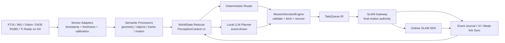
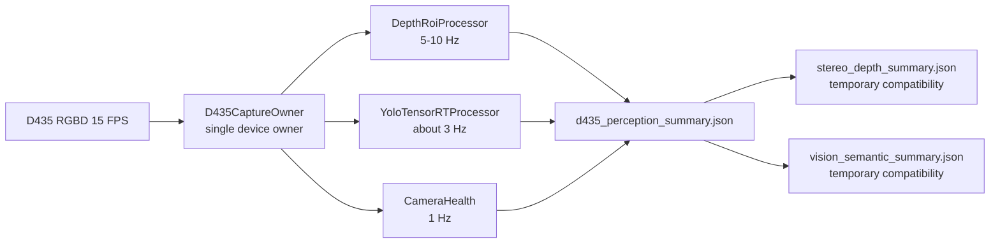

# GO2W 比赛边缘自治架构与新会话交接

日期：2026-06-12
更新：2026-06-13

## 1. 本轮收束结论

项目主线重新定义为：

> 面向比赛演示的多传感器语义驱动边缘自治系统。机器人在弱网或断网时仍能完成本地感知、任务决策、受控执行和结果记录；网络只影响远程交互和证据回传，不影响本地安全闭环。

前一阶段对定位、锚点和近场安全做了较多排查，这些工作保留为底层可靠性基础，但不能继续成为架构中心。后续优先级必须回到：

1. 每种传感器如何形成可信、带时间戳的语义。
2. 所有语义如何汇聚成唯一 `WorldState / PerceptionContext`。
3. LLM 何时被调用、能看到什么、能输出什么。
4. 决定层如何把 LLM 提议变成可验证任务。
5. Gateway 如何作为唯一运动裁决权威复用 Unitree SDK。
6. 弱网时任务如何继续、状态如何缓存和补传。

当前稳定分支为 `agent/llm-on-robot`，编写本交接时 HEAD 为 `1bad2e3`。未完成的方向安全实验已保存为：

```text
stash@{0}: wip: directional safety experiment before architecture reset
```

该 stash 不是稳定方案。新会话不得直接恢复，只有在逐文件审查且确认与本交接架构一致时才可选择性取回。

## 2. 唯一比赛闭环



唯一真实执行路径固定为：

```text
UI / voice / remote task
  -> deterministic router or local LLM
  -> TaskQueue IR
  -> MissionDecisionEngine
  -> robot-side SLAM Gateway
  -> Unitree SLAM SDK
  -> execution event
  -> WorldState / UI / local journal / weak-link sync
```

架构边界：

- LLM 不输出 `cmd_vel`、Unitree API ID、任意地图坐标或底层速度。
- LLM 只输出受限任务提议，例如导航到已注册拓扑点、拍照、等待、报告、请求确认。
- `MissionDecisionEngine` 负责参数绑定、能力检查、任务状态机、恢复和降级。
- Gateway 是唯一运动权威，最终检查定位、地图身份、传感器时效和运动条件。
- 上层重复的 `SafetyGate` 逐步降级为预检和解释，不再形成多个互相矛盾的权威。
- 比赛阶段继续使用现有 Python 常驻监督执行器承接真实任务，C++ OperatorPanel 不再发展第二套真实执行路径。

## 3. 传感器、频率和语义

频率分为三类，不能混在一个循环中：

1. **事实层高频数据**：只供驱动、SLAM和本地处理器使用。
2. **语义层中频摘要**：供决定层、安全逻辑和 UI 使用。
3. **LLM 低频事件上下文**：仅在任务开始、歧义、异常、恢复和终态时生成。

| 来源 | 当前事实输入 | 当前/目标语义频率 | 进入系统的语义 | 用途 |
|---|---|---:|---|---|
| XT16 点云 | ROS2 `PointCloud2`，真机观测约 `15.34 Hz` | 当前限速 `5 Hz` | 四向净空、置信度、阻断方向、标定状态 | 主几何安全源、局部避障依据 |
| XT16 IMU | 真机观测约 `250.27 Hz` | 目标运动摘要 `10-20 Hz` | 静止/运动、角速度异常、姿态可信度 | 状态估计、滑移和运动质量诊断 |
| 里程计/SLAM 位姿 | Unitree DDS/ROS2 | 位姿内部高频；WorldState `2-5 Hz` | 位姿、定位质量、漂移、当前拓扑邻域 | 导航、重定位、轨迹和到达判定 |
| D435 RGBD | `640x480 @ 15 FPS` | 深度目标 `5-10 Hz`；YOLO 约 `3 Hz` | 前视深度 ROI、目标类别/区域/距离 | 前向保守补充、场景语义 |
| TI 雷达 + NX | NX 本地原始 ADC/点云 | 摘要 `1-5 Hz`，事件即时 | track、距离、方位、径向速度、生命体征候选 | 搜救/生命探测扩展 |
| 关键帧相机 | 任务或事件触发 | 非周期 | 文件索引、时间、位置、标签 | 证据和报告，不进入高频控制 |

### 3.1 统一来源状态

每个来源必须先包装成 `SensorEnvelope`：

```json
{
  "source_id": "xt16_geometry",
  "source_kind": "lidar_geometry",
  "timestamp_ms": 0,
  "received_ms": 0,
  "age_ms": 0,
  "sequence": 0,
  "frame_id": "base_link",
  "status": "fresh",
  "confidence": 0.0,
  "calibration_id": "xt16_go2w_v1",
  "calibration_status": "verified",
  "producer": "xt16_geometry_sidecar",
  "payload": {}
}
```

`status` 只允许：

```text
fresh / stale / offline / invalid / uncalibrated
```

文件存在不等于在线。任何摘要读取器都必须同时验证生产进程、时间戳、单调序号和 stale budget。旧 artifact 不能继续作为 LLM 或决定层的当前输入。

### 3.2 统一感知上下文

所有适配器进入一个 `PerceptionContext v1`，再由 `WorldState Reducer` 生成当前状态：

```json
{
  "schema": "go2w_perception_context_v1",
  "generated_at_ms": 0,
  "robot_motion": {},
  "local_geometry": {},
  "visual_objects": [],
  "radar_tracks": [],
  "risk_events": [],
  "sources": [],
  "degraded_capabilities": []
}
```

Python Planner、C++ UI、日志和 LLM 必须消费同一份上下文，禁止各自从不同 artifact 拼接出不同世界。

## 4. D435 深度摘要与 DeepYOLO 合并

两者不是同一种算法：

- D435 深度摘要从硬件深度图计算前视 ROI 距离和置信度。
- DeepYOLO 从 RGB 图像识别目标，并使用深度为目标附加距离。

P0-1 之前两个侧车会独立打开同一台 D435，存在 USB 带宽、设备占用和时间戳
不一致问题。P0-1 已在采集端完成合并，不是只在 JSON 层合并。

目标结构：



实现约束：

- 只有 `D435CaptureOwner` 可以打开 RealSense 设备。
- 每个 depth/YOLO packet 的 RGB、depth、frame sequence 和 sensor timestamp
  来自其原始帧集；异步处理器的最新 sequence 允许不同。
- 深度处理不等待 YOLO；YOLO 负载过高时只丢弃 YOLO 帧，不影响深度摘要。
- 主输出为 `artifacts/d435_perception_summary.json`。
- 当前继续原子生成两个旧文件，保持现有 UI/Gateway 兼容。
- `go2w_stereo_depth_sidecar.sh` 和 `go2w_deepyolo_sidecar.sh` 只保留兼容入口，
  统一由 `go2w_d435_perception_sidecar.sh` 管理。
- YOLO 语义可增加谨慎或触发检查，不能授权运动；深度也不能解除 XT16 阻断。

## 5. LLM 输入

LLM 不读取原始图像、点云、雷达 ADC、完整日志或每个传感器周期。

输入由 `LlmContextBuilder` 从当前 WorldState 生成，必须有固定预算：

```text
task + current phase
registered topology candidates
capability contract
localization/map identity
fresh perception deltas
active risks and degraded sources
last decision and execution result
allowed tools
```

调用条件：

- 新任务且确定性路由不能唯一解析。
- 目标或意图存在歧义。
- 决定层请求重规划。
- 新的高价值语义事件出现。
- 任务终态需要自然语言总结。

不调用条件：

- 每次 SLAM 轮询。
- 每次传感器摘要更新。
- Gateway 已明确阻断且没有新信息。
- 已知拓扑点的简单导航命令可由确定性路由完成。

建议时延目标：

| 路径 | 目标 |
|---|---:|
| 已知命令确定性路由 | `<100 ms` |
| WorldState/决定层更新 | `2-5 Hz` |
| 本地 LLM 歧义规划 | 理想 `1-3 s`，比赛可接受上限另行实测 |
| 终态自然语言报告 | 不阻塞运动闭环 |

当前 Qwen3-4B Q4_K_M 历史评测约 `13.5 tok/s`，小规模测试还出现过 JSON 截断。下一阶段应先做常驻模型服务、限制输出长度、结构化/约束解码和上下文裁剪，不能靠提高调用频率解决智能问题。

## 6. LLM 输出和决定层

LLM 输出只允许 `TaskProposal`：

```json
{
  "schema": "go2w_task_proposal_v1",
  "intent": "inspect",
  "steps": [
    {
      "action": "navigate",
      "target_node": "registered_node_id"
    },
    {
      "action": "capture_keyframe"
    },
    {
      "action": "report"
    }
  ],
  "needs_confirmation": false,
  "explanation": "..."
}
```

`MissionDecisionEngine` 负责：

- schema 和工具白名单校验；
- 拓扑点、地图和能力绑定；
- 把语义动作转成现有 `TaskQueue IR`；
- 状态机和任务租约；
- 调用前的确定性预检；
- Gateway 拒绝后的 hold、retry、relocalize、replan 或人工确认；
- 记录每次提议、裁决、执行和反馈。

Gateway 拒绝信息必须原样进入 `DecisionRecord`：

```text
authority / policy_version / decision / reason /
motion_direction / sensor_age / timestamp
```

LLM 可以解释拒绝原因，但不能覆盖拒绝结果。

## 7. 弱网闭环

弱网不是 UI 标签，而是 `CommunicationPolicyExecutor` 的实际行为：

| 网络状态 | 本地任务 | 上行策略 |
|---|---|---|
| normal | 正常执行 | 低频 WorldState、事件、按需关键帧 |
| weak | 正常执行 | 只发语义 delta、终态和高价值事件 |
| disconnected | 正常执行或按任务策略 hold | 本地 append-only journal，禁止等待云端 |
| recovered | 继续当前状态 | 按事件序号补传，不重放运动命令 |

本地必须保存：

- 当前任务和状态机快照；
- 未确认的关键事件；
- Gateway 最终裁决；
- 关键帧索引，不默认缓存连续视频；
- last acknowledged event sequence。

远端重连只同步状态和新任务，不直接接管底层控制。

## 8. TI 雷达与 NX 扩展

NX 负责原始数据、信号处理、目标跟踪和生命体征算法，机器人只接收有界语义：

```json
{
  "source_id": "nx_ti_radar",
  "timestamp_ms": 0,
  "status": "fresh",
  "tracks": [],
  "events": [],
  "nearest_target": null,
  "vital_sign_candidate": null
}
```

要求：

- 常规摘要 `1-5 Hz`，风险/生命体征状态变化立即发事件。
- 每条消息有 sequence、timestamp、schema version 和 source identity。
- 初期 `semantic_only`，不直接授权运动。
- 接入层可以从文件迁移到本地 HTTP、MQTT、DDS 或 ROS2，但上层 `PerceptionContext` 不变。
- NX 离线时只降级雷达能力，不能拖死 SLAM、XT16、D435 或本地任务状态机。

## 9. 是否训练或 LoRA

当前不进行全量训练，也不把 LoRA 作为 P0。

原因：

- 当前主要错误来自上下文不统一、旧摘要伪在线、执行路径重复、弱网策略未真正执行和 Gateway 反馈丢失。
- LoRA 不能修复传感器时效、相机争用、任务租约或实时循环。
- 现有约 55 条训练样本只够验证训练管线，不足以证明比赛泛化能力。

先完成：

1. 唯一 WorldState 和输出 schema。
2. 常驻模型服务与约束解码。
3. 确定性快速路径。
4. 真实任务日志和失败样本采集。
5. 统一离线评测。

当高质量失败驱动样本达到约 `300-800` 条，并且剩余错误稳定集中在中文意图归一化、固定 JSON 生成或澄清策略时，再评估 QLoRA/LoRA。训练在外部工作站完成，NX 只部署量化模型或适配后的产物。

## 10. 当前主要缺口

P0：

- `OperatorPanel` 没有把已支持的 `perception_summaries` 真正写入唯一 WorldState。
- Python Planner 和 C++ HTTP LLM 各自构造上下文，信息不一致。
- 旧 artifact 文件可能在生产进程停止后仍被误认为当前输入。
- D435 深度与 DeepYOLO 争抢同一设备。
- 弱网策略未真正控制上传、缓存和补传。
- Gateway 拒绝原因在上层被压缩成泛化错误。
- Python 与 C++ 仍保留重复真实执行痕迹。
- XT16 几何链已接入但标定仍需完成后才能作为比赛可信数据。

P1：

- IMU、里程计没有独立健康/运动质量语义。
- TI/NX 只有 schema 和文件 loader，没有传输、时间同步、认证和重放保护。
- UI 未完整展示数据新鲜度、实际弱网上传策略、缓存事件数和 Gateway 最终裁决。
- 关键帧、语音和任务报告仍需形成统一任务动作闭环。

## 11. 新会话实施顺序

### P0-1：统一 D435 感知服务（已完成）

1. 审查 `build_deepyolo_headless.sh` 生成代码的数据流。
2. 让 DeepYOLO 现有 RGBD capture 同时输出深度 ROI。
3. 定义 `d435_perception_summary` schema。
4. 新建单一 sidecar manager。
5. 原子写主摘要，并兼容生成两个旧摘要。
6. 验证只有一个进程持有 D435。
7. 对比深度摘要数值、YOLO FPS、CPU/GPU 和 SLAM poll overruns。

完成证据：

```text
completion_tag: p0-1-unified-d435-accepted-20260613
robot_python: 261/261
capture_owner_count: 1
depth_unique_sequences_3s: 12
yolo_unique_sequences_3s: 3
compat_generation_id_match: true
yolo_missing_degradation: d435_yolo only
motion_commands_sent: false
service_final_state: stopped
```

说明：深度和 YOLO 都必须携带其来源 RGBD frameset 的 sequence 与 sensor
timestamp。由于两个处理器频率不同，最新 depth 与最新 YOLO 的 sequence
允许不同，差值必须可观测，不能伪装成同一帧。

### P0-2：统一 PerceptionContext

1. 新建 `SensorEnvelope / PerceptionContext v1` schema。已完成。
2. 为 XT16、D435、TI/NX 增加统一 freshness loader。已完成 Python
   归一化入口、producer instance 和序号回退检测。
3. WorldState Reducer 只消费统一 loader。已完成 Python/C++ reducer
   `PerceptionContext v1` 接口和 context stale 校验。
4. Python Planner、C++ LLM、UI 和 runtime log 改读同一份 context。已完成
   本地和机器人无运动验收。
5. 增加 stale/offline/uncalibrated 测试。已完成。

### P0-3：收口决定与执行路径

1. 把 `TaskQueue IR` 固定为唯一任务中间表示。
2. 明确 Python 常驻执行器为比赛上层监督器。
3. C++ 直接真实执行改为诊断/兼容入口。
4. Gateway 拒绝详情完整反馈。
5. 增加断定位、地图错配、传感器过期和断网验收。

### P0-4：真实弱网执行

1. 实现 `CommunicationPolicyExecutor`。
2. 建立本地事件 journal 和 ack sequence。
3. 限制关键帧、关闭原始视频/点云上行。
4. 做断网继续执行、重连补传且不重放命令的验收。

### P1：LLM、UI、TI/NX

1. 常驻本地 LLM 服务和约束输出。
2. UI 展示 LLM 输入摘要、决定层裁决和弱网真实状态。
3. 接入 TI/NX live transport。
4. 补齐关键帧、语音、报告动作。
5. 建立比赛任务集和失败样本库。

## 12. 新会话第一阶段验收

第一阶段必须同时满足：

- D435 只有一个设备持有进程。
- 深度与 YOLO 摘要共享 frame sequence 和 sensor timestamp。
- YOLO 卡顿不影响深度摘要刷新。
- 所有摘要停止生产后按 stale budget 失效。
- LLM、UI 和决定层看到同一份 PerceptionContext。
- 已知拓扑命令无需 LLM 也能生成合法 TaskQueue。
- LLM 输出不能绕过决定层或 Gateway。
- 弱网/断网不阻塞本地感知和 Gateway。
- 测试、运行手册、架构图和 Obsidian 日志同步更新。

## 13. 2026-06-13 阶段状态

当前目标：

- P0-1 已在提交 `9f88baf` 完成真机无运动验收、推送和机器人
  fast-forward；本地、origin 与机器人提交一致。
- P0-1 Git 完成标记为 `p0-1-unified-d435-accepted-20260613`。
- P0-2 首个独立提交已完成 schema、XT16/D435/TI-NX loaders、运动摘要预留
  接口和 fail-closed 测试。
- P0-2 WorldState integration 已完成：Python/C++ reducer 只接受同一份
  PerceptionContext，旧自由格式 summary 输入已删除。
- P0-2 unified runtime consumers 已完成：单一 producer 写
  `artifacts/perception_context_v1.json`，Planner、C++ LLM、UI 和 runtime
  log 不再独立读取传感器 artifact。
- 机器人实现提交 `d8e9125` 无运动验收通过：Python targeted `81/81`、
  full `286/286`，C++ build/CTest `6/6`，五个消费者 `context_id` 一致。
- P0-2 完成标记为 `p0-2-perception-context-v1-accepted-20260613`。
- 下一步唯一任务是 P0-3：收口唯一决定与执行路径。

稳定决策：

- Git 提交是机器人唯一代码来源，不长期保留手工覆盖文件。
- 旧 D435/DeepYOLO 入口只能转发到统一 manager。
- 停止的生产进程和旧 artifact 不得被判定为 fresh。
- fresh 来源必须提供原生 sequence 和稳定 producer instance；缺失时不伪造。
  D435 在同一 owner instance 内发生序号回退时归一化为 `invalid`。
- `PerceptionContext` 固定
  `TaskQueue -> MissionDecisionEngine -> SLAM Gateway -> Unitree SDK`
  为唯一执行链，且 `llm_direct_motion=false`。
- 不启动 SLAM、Gateway 或底盘运动来重复 P0-1 验收。

已知风险：

- XT16 仍是 `pending_field_measurement`，不在 P0-1 中扩展处理。
- XT16 当前旧摘要归一化为非 fresh，正式标定和低速运动验收仍 deferred。
- 当前 TI/NX 没有仓库内 bridge supervisor；未提供明确在线证据时 loader
  必须输出 `offline`，即使 artifact 存在。

Deferred issues：

- XT16 五场人工标定和真实低速运动验收。
- TI/NX live transport、时间同步、认证和重放保护。
- 弱网 journal、ack sequence 和补传执行器。

## 14. P0-3 本地实现状态

当前本地实现已完成：

- 所有最终 Planner 计划归一化为 `TaskQueue IR`。
- 新增 `MissionDecision v1` schema 和确定性决定层。
- 删除 Python 单条 `slam_command` 直达 Gateway 的真实执行兜底。
- Python persistent supervised executor 是唯一比赛上层监督器。
- C++ 语义路由固定为 dry-run/诊断兼容入口，真实导航转交 Python。
- Gateway 拒绝详情进入统一 DecisionRecord、UI 和 runtime log。
- 断定位、地图错配、传感器过期和 Gateway 断网测试均 fail closed。
- 策略覆盖后的 `human_confirm/safe_hold` 不会复用旧导航队列。

本地验证：

```text
python_targeted: 76/76 passed
python_full_unittest: 298/298 passed
python_compile: passed
git_diff_check: passed
motion_commands_sent: false
```

当前 P0-3 尚未打完成标记。剩余唯一验收步骤是：提交推送后让机器人
fast-forward 到该提交，执行 C++ build/CTest、Python 定向/全量无运动测试、
三端 commit 核对和服务残留检查。

P0-3 完成后下一步唯一任务是 P0-4：实现真实
`CommunicationPolicyExecutor + append-only journal + ack sequence`，验证断网继续
本地执行和重连补传不重放运动命令。
