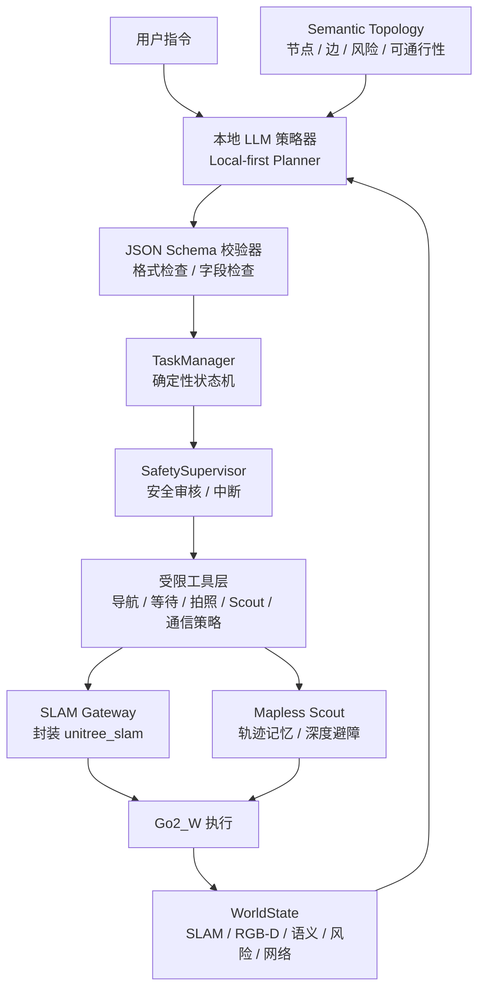
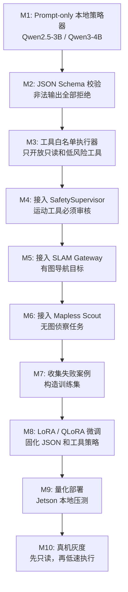

# 本地 LLM 闭环策略、工具调用与微调路线

本文档专门说明本项目中 LLM 应该怎么选型、怎么本地部署、能调用哪些工具、如何接入机器人闭环，以及后续如何微调。核心原则是：

**运行时主闭环必须 Local-first。本地 LLM 是策略层核心，云端 LLM 只作为离线开发、训练数据生成、对比评测和调试辅助，不作为比赛/演示主规划器。**

---

## 1. 为什么不能把云端 LLM 当主规划器

本项目的题目是“弱带宽远程交互”和“边缘自治”。如果运行时还依赖云端 LLM 做主规划，会出现三个问题：

1. **逻辑矛盾**：弱网场景下，云端主规划最先失效。
2. **工程不稳**：网络延迟、丢包、断链都会直接影响任务执行。
3. **创新点削弱**：项目会变成“云端智能 + 本地执行”，不再是边缘自治。

因此运行时架构应改成：

```text
本地 LLM：主策略器
本地规则/状态机：安全验证与执行编排
本地感知：YOLO / RGB-D / SLAM / 里程计
云端 LLM：离线辅助，不进入主闭环
```

云端可以做：

- 离线生成训练样本。
- 帮助整理 prompt 和工具 schema。
- 对本地模型输出做离线评分。
- 开发阶段做上限对比。

云端不应该做：

- 比赛现场主规划。
- 实时任务决策。
- 安全裁决。
- 机器人运动闭环控制。

---

## 2. 本地 LLM 在系统中的真实职责

本地 LLM 不是毫秒级控制器。它应该是：

**低频、事件驱动、结构化输出的策略规划器。**

它负责：

- 理解用户任务。
- 读取 `WorldState`、语义拓扑图、链路质量和任务上下文。
- 选择执行模式：有图导航、无图侦察、安全等待、请求人工确认。
- 生成结构化步骤。
- 调用受限工具。
- 解释当前策略。

它不负责：

- 直接输出 `cmd_vel`。
- 直接控制电机。
- 直接调用 `slam_operate`。
- 直接绕过安全层。
- 处理原始点云或连续视频。

推荐闭环频率：

| 模块 | 推荐频率 | 说明 |
|---|---:|---|
| 电机/底层控制 | 官方系统内部处理 | 不由 LLM 参与 |
| 安全监督 | 5 到 20 Hz | 可以随时中断 |
| 感知/风险更新 | 5 到 30 Hz | YOLO、深度、近距离风险 |
| WorldState 更新 | 1 到 5 Hz | 给 LLM 和远端摘要 |
| 本地 LLM 策略循环 | 0.2 到 1 Hz 或事件触发 | 任务阶段变化、风险变化、用户新指令时触发 |

一句话：

**LLM 是策略闭环，不是实时控制闭环。**

---

## 3. 推荐运行时架构



关键点：

1. 本地 LLM 输出 JSON，不直接执行动作。
2. JSON 必须先通过 schema 校验。
3. 所有会让机器人运动的工具必须经过 `SafetySupervisor`。
4. `TaskManager` 是确定性状态机，不能完全交给 LLM 自由发挥。
5. `SLAM Gateway` 是唯一能把目标转换成 `slam_operate` 的模块。

---

## 4. 模型选型建议

### 4.1 结论

在 Jetson Orin NX 16GB 上，本项目不建议把本地 7B+ 或本地 VLM 当主链路。更稳的路线是：

```text
视觉语义：YOLO / RGB-D / 专用视觉模型
策略规划：本地 1.5B 到 4B 文本 LLM
安全裁决：规则与状态机
```

推荐模型分三档：

| 档位 | 模型 | 用途 | 建议 |
|---|---|---|---|
| 第一候选 | `Qwen3-4B-Instruct` INT4 / W4A16 | 本地主策略器 | 能跑稳后作为比赛目标 |
| 稳定候选 | `Qwen2.5-3B-Instruct` 4bit GGUF / AWQ | 本地主策略器或微调基座 | 最适合先做工程闭环 |
| 保底候选 | `Qwen2.5-1.5B-Instruct` 4bit | 命令归一化、简单策略、断链兜底 | 能力较弱，但资源压力小 |

不建议第一阶段使用：

- 7B+ dense 模型作为主闭环。
- 本地 VLM 直接看图做规划。
- LLM 直接处理长视频或点云。
- 多个 LLM 同时常驻。

### 4.2 为什么推荐 Qwen 系列

理由：

- 中文指令理解相对稳。
- 对 JSON/结构化输出比较友好。
- 小参数版本覆盖 1.5B、3B、4B，适合 Orin NX 16GB。
- 社区量化和部署路径成熟。
- 后续 LoRA / QLoRA 微调资料较多。

### 4.3 三个具体部署档

#### A 档：Qwen3-4B-Instruct INT4 / W4A16

定位：

```text
最终比赛候选，本地策略主模型。
```

适合做：

- 多模式策略选择。
- 工具调用。
- 复杂中文任务拆解。
- 语义拓扑推理。

注意：

- 要先验证和 YOLO、RGB-D、ROS2 节点同时运行时的内存占用。
- 上下文不要拉太长，优先传当前任务相关的拓扑子图。
- 运行时温度建议低一些，保证输出稳定。

建议推理配置：

```json
{
  "temperature": 0.1,
  "top_p": 0.8,
  "max_new_tokens": 512,
  "context_window_target": 2048,
  "output_format": "strict_json"
}
```

#### B 档：Qwen2.5-3B-Instruct 4bit

定位：

```text
第一阶段最稳工程选择。
```

适合做：

- 本地 JSON 策略输出。
- 任务命令归一化。
- 语义拓扑图上的阶段规划。
- 微调基座。

建议原因：

- 参数量 3.09B，能力和资源压力比较平衡。
- 适合先用 `llama.cpp` / Ollama / AWQ 跑通闭环。
- 微调和量化资料更成熟。

建议推理配置：

```json
{
  "temperature": 0.0,
  "top_p": 0.7,
  "max_new_tokens": 384,
  "context_window_target": 2048,
  "output_format": "strict_json"
}
```

#### C 档：Qwen2.5-1.5B-Instruct 4bit

定位：

```text
极限资源保底模型。
```

适合做：

- 用户命令归一化。
- 简单工具选择。
- 网络断链兜底策略。

不适合做：

- 复杂长任务规划。
- 多条件风险推理。
- 复杂拓扑重规划。

---

## 5. 推理运行工具推荐

### 5.1 llama.cpp / GGUF

用途：

```text
第一阶段快速跑通本地 LLM 闭环。
```

优点：

- 部署简单。
- 量化模型生态成熟。
- 容易控制上下文、线程、GPU offload。
- 出问题时容易调试。

适合模型：

- `Qwen2.5-3B-Instruct-GGUF`
- `Qwen2.5-1.5B-Instruct-GGUF`
- `Qwen3-4B-GGUF`

建议用途：

```text
先用它把 Planner -> JSON -> Safety -> Tool Executor 跑通。
```

### 5.2 Ollama

用途：

```text
开发阶段快速服务化。
```

优点：

- 起服务简单。
- API 调用方便。
- 适合本地调试 prompt 和工具格式。

风险：

- 对 Jetson 的性能和内存控制不如底层工具透明。
- 量化和 GPU offload 需要实际测试。

建议用途：

```text
开发期可以用，比赛部署前要压测。
```

### 5.3 NVIDIA Jetson AI Lab / vLLM Container

用途：

```text
Jetson 上更高性能的服务化部署。
```

优点：

- Jetson 官方生态方向。
- 对 Qwen3-4B 这类边缘模型有现成参考。
- 可以使用 OpenAI-compatible API 形式调用本地服务。

适合：

- `Qwen3-4B` W4A16 / INT4 类量化部署。

注意：

- 需要和当前 JetPack、CUDA、系统镜像适配。
- 需要在真机上压测 ROS2、YOLO、深度相机同时运行的内存压力。

### 5.4 TensorRT-LLM / TensorRT Edge-LLM

用途：

```text
后期性能优化。
```

优点：

- 更适合固定模型、固定上下文、固定延迟目标。
- INT4 AWQ 权重可显著降低内存占用。

风险：

- 工具链复杂。
- 构建、导出、引擎配置需要时间。

建议：

```text
第一阶段不要从 TensorRT-LLM 开始。先 llama.cpp/Ollama 跑通闭环，再迁移优化。
```

---

## 6. 本地 LLM 能调用哪些工具

LLM 不能自由调用系统命令。它只能输出受限工具请求，然后由本地执行器校验和执行。

### 6.1 工具分级

| 工具类型 | 是否允许 LLM 直接建议 | 是否需要安全层 | 说明 |
|---|---|---|---|
| 查询状态 | 允许 | 否 | 只读 |
| 生成计划 | 允许 | 否 | 结构化输出 |
| 拍关键帧 | 允许 | 低风险校验 | 不移动机器人 |
| 等待条件 | 允许 | 否 | 状态机执行 |
| 导航目标 | 允许建议 | 必须 | 会让机器人运动 |
| Mapless Scout | 允许建议 | 必须 | 会让机器人运动 |
| 暂停/急停 | 允许 | 可直接高优先级执行 | 安全动作 |
| 恢复导航 | 允许建议 | 必须 | 恢复运动 |
| 直接速度控制 | 禁止 | 不开放 | 不给 LLM |
| 直接 `slam_operate` | 禁止 | 不开放 | 只给 Gateway |

### 6.2 推荐工具列表

#### `query_world_state`

只读工具。

```json
{
  "tool": "query_world_state",
  "arguments": {
    "include": ["robot", "risk_events", "navigation_feedback", "link_quality"]
  }
}
```

#### `query_semantic_topology`

只读工具。

```json
{
  "tool": "query_semantic_topology",
  "arguments": {
    "center_node": "current",
    "target_node": "lab_door",
    "max_hops": 3
  }
}
```

#### `create_navigation_subgoal`

运动相关工具，需要安全审核。

```json
{
  "tool": "create_navigation_subgoal",
  "arguments": {
    "goal_id": "go-corridor-a",
    "target_node": "corridor_a",
    "target_pose": { "x": 1.5, "y": 0.3, "yaw": 0.0 },
    "constraints": {
      "max_linear_speed_mps": 0.4,
      "max_angular_speed_rps": 0.4,
      "safety_mode": "conservative"
    }
  }
}
```

#### `start_mapless_scout`

运动相关工具，需要安全审核。

```json
{
  "tool": "start_mapless_scout",
  "arguments": {
    "task_id": "scout-forward-001",
    "max_distance_m": 20,
    "max_duration_s": 120,
    "max_linear_speed_mps": 0.25,
    "min_obstacle_distance_m": 1.2,
    "return_mode": "trace_back",
    "capture_keyframe_at_turnaround": true
  }
}
```

#### `wait_until`

低风险工具，由任务状态机执行。

```json
{
  "tool": "wait_until",
  "arguments": {
    "condition": {
      "type": "node_clear",
      "node_id": "lab_door",
      "category": "person",
      "min_clear_distance_m": 1.5
    },
    "timeout_s": 30
  }
}
```

#### `capture_keyframe`

低风险工具。

```json
{
  "tool": "capture_keyframe",
  "arguments": {
    "reason": "arrived_at_inspection_point",
    "target_node": "lab_door",
    "send_policy": "low_bandwidth"
  }
}
```

#### `set_communication_policy`

通信策略工具。

```json
{
  "tool": "set_communication_policy",
  "arguments": {
    "mode": "semantic_only",
    "send": ["task_state", "risk_events", "keyframe"],
    "drop": ["raw_video", "dense_pointcloud"],
    "reason": "weak bandwidth detected"
  }
}
```

#### `request_human_confirm`

人工确认工具。

```json
{
  "tool": "request_human_confirm",
  "arguments": {
    "level": "warning",
    "message": "SLAM 质量低且返回置信度不足，是否允许继续前出侦察？",
    "options": ["continue_slowly", "return_now", "hold_position"]
  }
}
```

### 6.3 禁止开放给 LLM 的工具

这些工具不能直接给 LLM：

```text
publish_cmd_vel
send_motor_command
raw_slam_operate
system_shell
edit_config
restart_unitree_slam
disable_safety_supervisor
```

原因很直接：这些工具要么会直接运动，要么会破坏系统稳定性，要么绕过安全层。

---

## 7. LLM 输出格式

LLM 每次只输出一个严格 JSON 对象。

推荐统一格式：

```json
{
  "plan_id": "inspect-lab-door-001",
  "mode": "mapped_navigation",
  "confidence": 0.84,
  "reason": "目标在已知地图中，SLAM 定位正常，但目标附近有人，先去观察点等待。",
  "steps": [
    {
      "step_id": "go-observation-node",
      "tool": "create_navigation_subgoal",
      "arguments": {
        "goal_id": "go-corridor-a",
        "target_node": "corridor_a",
        "target_pose": { "x": 1.5, "y": 0.3, "yaw": 0.0 },
        "constraints": {
          "max_linear_speed_mps": 0.4,
          "max_angular_speed_rps": 0.4,
          "safety_mode": "conservative"
        }
      }
    },
    {
      "step_id": "wait-door-clear",
      "tool": "wait_until",
      "arguments": {
        "condition": {
          "type": "node_clear",
          "node_id": "lab_door",
          "category": "person",
          "min_clear_distance_m": 1.5
        },
        "timeout_s": 30
      }
    }
  ],
  "communication_policy": {
    "mode": "semantic_only",
    "send": ["task_state", "risk_events", "keyframe"],
    "drop": ["raw_video", "dense_pointcloud"]
  },
  "requires_human_ack": false
}
```

输出约束：

- 不能输出自然语言散文作为主结果。
- 不能输出未注册工具。
- 不能输出速度控制。
- 不能输出超过安全上限的速度。
- 不能绕过 `SafetySupervisor`。
- 不确定时必须选择 `request_human_confirm` 或 `hold_position`。

---

## 8. 本地闭环运行示例

用户命令：

```text
去实验室门口巡检，如果有人就等，网络不好也要继续完成。
```

当前状态：

```json
{
  "robot_state": {
    "pose": { "x": 0.4, "y": 1.2, "yaw": 0.0 },
    "localized": true,
    "battery_percent": 78
  },
  "slam_status": "healthy",
  "link_quality": {
    "bandwidth_kbps": 90,
    "latency_ms": 850,
    "packet_loss_ratio": 0.2
  },
  "semantic_topology": {
    "current_node": "start_area",
    "target_node": "lab_door",
    "candidate_path": ["start_area", "corridor_a", "lab_door"]
  },
  "risk_events": [
    {
      "event_type": "human_near_target",
      "severity": "high",
      "node_id": "lab_door",
      "distance_m": 0.6
    }
  ]
}
```

本地 LLM 应输出：

```json
{
  "plan_id": "inspect-lab-door-001",
  "mode": "mapped_navigation",
  "confidence": 0.86,
  "reason": "SLAM 正常但网络弱，目标附近有人。先切换语义通信，并导航到走廊观察点等待。",
  "steps": [
    {
      "step_id": "switch-low-bandwidth",
      "tool": "set_communication_policy",
      "arguments": {
        "mode": "semantic_only",
        "send": ["task_state", "risk_events", "keyframe"],
        "drop": ["raw_video", "dense_pointcloud"],
        "reason": "bandwidth below threshold"
      }
    },
    {
      "step_id": "go-observation-node",
      "tool": "create_navigation_subgoal",
      "arguments": {
        "goal_id": "go-corridor-a",
        "target_node": "corridor_a",
        "target_pose": { "x": 1.5, "y": 0.3, "yaw": 0.0 },
        "constraints": {
          "max_linear_speed_mps": 0.35,
          "max_angular_speed_rps": 0.4,
          "safety_mode": "conservative"
        }
      }
    },
    {
      "step_id": "wait-lab-door-clear",
      "tool": "wait_until",
      "arguments": {
        "condition": {
          "type": "node_clear",
          "node_id": "lab_door",
          "category": "person",
          "min_clear_distance_m": 1.5
        },
        "timeout_s": 30
      }
    }
  ],
  "requires_human_ack": false
}
```

执行器接下来做：

```text
1. 校验 JSON。
2. 执行通信策略切换。
3. 把 go-corridor-a 交给 SafetySupervisor。
4. SafetySupervisor 放行后，SLAM Gateway 调用 slam_operate 1102。
5. 等待期间持续监听风险事件。
6. 人离开后再触发下一轮本地 LLM 策略。
```

---

## 9. Prompt 设计原则

系统 prompt 应该很短、硬约束明确。

推荐系统 prompt：

```text
你是运行在四足机器人 Jetson Orin NX 上的本地策略规划器。
你必须只输出严格 JSON。
你不能直接控制电机、速度或 slam_operate。
你只能从 registered_tools 中选择工具。
所有会导致机器人运动的工具都会经过 SafetySupervisor。
如果状态不确定、定位不可靠、返回置信度低或风险高，你必须选择 hold_position 或 request_human_confirm。
优先保证安全，其次保证任务完成，再其次优化速度。
```

输入上下文应该只给必要信息：

```text
用户命令
当前任务阶段
机器人状态
导航反馈
语义拓扑子图
风险事件
网络质量
可用工具
安全阈值
```

不要给：

```text
完整原始地图
长视频描述
大段历史聊天
全部日志
点云
过多无关节点
```

---

## 10. 微调之前先做什么

不要一开始就微调。顺序应该是：

```text
Prompt + JSON Schema + 工具白名单
  -> 收集失败案例
  -> 少量高质量样本微调
  -> 量化部署
  -> 真机离线评估
  -> 再决定是否扩大数据集
```

优先修：

- JSON 格式错误。
- 工具名错误。
- 风险场景下乱走。
- 弱网时仍请求视频。
- SLAM 不可靠时仍下发远距离导航。
- Mapless Scout 里距离/速度过大。

这些问题可以先靠 prompt、schema 和规则拦截解决。只有当模型稳定性仍然不够，再做微调。

---

## 11. 微调目标

微调不是为了让模型“懂机器人全部知识”，而是为了让它稳定学会：

1. 按固定 JSON 输出。
2. 正确选择工具。
3. 遇到风险保守处理。
4. 弱网下切换通信策略。
5. SLAM 退化时选择 Mapless Scout 或请求人工确认。
6. 不输出底层控制。

不要把地图点、具体场地坐标硬塞进模型权重。地图和拓扑应该运行时注入。

正确微调目标：

```text
学会决策格式和策略风格。
```

错误微调目标：

```text
让模型背下实验室地图。
```

---

## 12. 微调数据格式

推荐使用 instruction tuning 数据，每条样本包含：

- system 约束。
- user 任务。
- context 状态。
- assistant 严格 JSON 输出。

样例：

```json
{
  "messages": [
    {
      "role": "system",
      "content": "你是本地机器人策略规划器。只能输出严格 JSON，只能调用注册工具，不能直接控制速度。"
    },
    {
      "role": "user",
      "content": "去实验室门口巡检，如果有人就等待。"
    },
    {
      "role": "user",
      "content": {
        "world_state": {
          "robot": {
            "pose": { "x": 0.4, "y": 1.2, "yaw": 0.0 },
            "localized": true
          },
          "risk_events": [
            {
              "event_type": "human_near_target",
              "severity": "high",
              "node_id": "lab_door",
              "distance_m": 0.6
            }
          ],
          "link_quality": {
            "bandwidth_kbps": 90,
            "latency_ms": 850
          }
        },
        "semantic_topology": {
          "current_node": "start_area",
          "target_node": "lab_door",
          "candidate_path": ["start_area", "corridor_a", "lab_door"]
        },
        "registered_tools": [
          "set_communication_policy",
          "create_navigation_subgoal",
          "wait_until",
          "request_human_confirm"
        ]
      }
    },
    {
      "role": "assistant",
      "content": {
        "plan_id": "inspect-lab-door-001",
        "mode": "mapped_navigation",
        "confidence": 0.86,
        "reason": "目标附近有人且网络弱，先切换语义通信并去观察点等待。",
        "steps": [
          {
            "step_id": "switch-low-bandwidth",
            "tool": "set_communication_policy",
            "arguments": {
              "mode": "semantic_only",
              "send": ["task_state", "risk_events", "keyframe"],
              "drop": ["raw_video", "dense_pointcloud"]
            }
          },
          {
            "step_id": "go-observation-node",
            "tool": "create_navigation_subgoal",
            "arguments": {
              "goal_id": "go-corridor-a",
              "target_node": "corridor_a",
              "target_pose": { "x": 1.5, "y": 0.3, "yaw": 0.0 },
              "constraints": {
                "max_linear_speed_mps": 0.35,
                "safety_mode": "conservative"
              }
            }
          }
        ],
        "requires_human_ack": false
      }
    }
  ]
}
```

注意：

如果训练框架不支持 JSON 对象作为 content，就把 `content` 序列化成字符串，但仍要求 assistant 输出能被 JSON 解析。

---

## 13. 数据集怎么构造

第一版数据集不追求大，追求高质量和覆盖风险。

建议规模：

| 阶段 | 样本量 | 目标 |
|---|---:|---|
| Prompt-only 验证 | 50 到 100 | 找输出格式和策略漏洞 |
| SFT 小样本 | 300 到 800 | 固化 JSON 格式和工具选择 |
| SFT 稳定版 | 2000 到 5000 | 覆盖主要任务场景 |
| 偏好优化 DPO | 200 到 1000 对 | 学会保守优先和拒绝危险动作 |

样本类型必须覆盖：

| 类型 | 示例 |
|---|---|
| 正常有图导航 | 去 A 点巡检，拍照，返回 |
| 目标附近有人 | 先去观察点，等待清空 |
| 前方障碍 | 请求重规划或暂停 |
| 弱网 | 切语义摘要和关键帧 |
| SLAM 正常但网络弱 | 本地继续执行，不传视频 |
| SLAM 退化 | 不下发远距离导航，选择 Scout 或人工确认 |
| 无图侦察 | 前出 10 到 30 米，拍照，原路返回 |
| 返回置信度低 | 停下并请求人工确认 |
| 电量低 | 中止任务或返回充电点 |
| 用户危险指令 | 拒绝高速、拒绝穿越人群 |
| 工具不可用 | 换模式或请求人工 |
| JSON 边界情况 | 空风险、多个目标、目标不可达 |

---

## 14. 微调方法建议

### 14.1 第一阶段：SFT / LoRA

推荐：

```text
Qwen2.5-3B-Instruct + LoRA / QLoRA
```

原因：

- 3B 模型能力和成本平衡。
- 微调资料多。
- 适合学习固定 JSON 策略风格。

训练目标：

```text
给定任务 + WorldState + 工具列表 -> 输出合法工具计划 JSON。
```

### 14.2 第二阶段：DPO 或偏好数据

当模型会输出 JSON 后，再考虑偏好优化。

偏好样本例子：

| 场景 | 好输出 | 坏输出 |
|---|---|---|
| 人在目标点 | 等待或观察点 | 直接靠近 |
| 网络弱 | 语义通信 | 继续请求视频 |
| SLAM 不可靠 | Scout/人工确认 | 下发远距离导航 |
| 返回置信度低 | 停下确认 | 继续前进 |

不建议第一阶段做复杂 RL。工程收益不高，调试成本大。

### 14.3 训练位置

Orin NX 16GB 不适合作为主要训练设备。建议：

```text
训练：台式机 GPU / 云端 GPU / 实验室服务器
部署：Orin NX 量化推理
```

训练完成后：

```text
LoRA adapter -> 合并或加载 adapter -> 量化 -> Jetson 部署 -> 离线评估 -> 真机灰度
```

---

## 15. 微调评估指标

离线评估必须先过，再上真机。

| 指标 | 目标 |
|---|---:|
| JSON 可解析率 | >= 99% |
| 工具名合法率 | >= 99% |
| 必填字段完整率 | >= 98% |
| 危险场景保守率 | >= 98% |
| 弱网通信策略正确率 | >= 95% |
| SLAM 退化处理正确率 | >= 95% |
| 平均策略延迟 | <= 2 秒 |
| 本地内存占用 | 不影响 ROS2 + YOLO + 深度相机 |

真机评估：

| 场景 | 指标 |
|---|---|
| 有图巡检 | 任务完成率、到达率 |
| 弱网巡检 | 带宽占用、事件延迟 |
| 人进入路径 | 暂停响应时间、最近距离 |
| Mapless Scout | 返回误差、接管次数 |
| SLAM 退化 | 是否切换模式、是否避免危险导航 |

---

## 16. 本地 LLM 和安全层的责任边界

必须明确：

```text
LLM 给建议。
TaskManager 排队。
SafetySupervisor 审核。
Gateway 执行。
Robot 反馈。
```

任何 LLM 输出都不能直接变成机器人运动。

危险例子：

```json
{
  "tool": "create_navigation_subgoal",
  "arguments": {
    "target_pose": { "x": 30.0, "y": 0.0, "yaw": 0.0 },
    "constraints": {
      "max_linear_speed_mps": 1.5,
      "safety_mode": "normal"
    }
  }
}
```

安全层应拦截：

```json
{
  "action": "reject",
  "reason": "requested speed exceeds local safety limit and target is too far for current confidence",
  "suggested_alternative": {
    "tool": "start_mapless_scout",
    "max_distance_m": 10,
    "max_linear_speed_mps": 0.25
  }
}
```

---

## 17. 推荐落地顺序



第一阶段完成标准：

```text
断网情况下，本地模型能根据 WorldState 输出合法 JSON 策略。
```

第二阶段完成标准：

```text
安全层能拦截所有危险策略，模型输出只作为建议。
```

第三阶段完成标准：

```text
有图导航、弱网通信、Mapless Scout 三类任务都能由本地 LLM 选择模式并触发正确工具。
```

---

## 18. 项目中的推荐技术栈

建议组合：

```text
本地模型：
  Qwen2.5-3B-Instruct 4bit 起步
  Qwen3-4B-Instruct INT4/W4A16 作为比赛目标

推理：
  llama.cpp / Ollama 起步
  Jetson AI Lab vLLM 或 TensorRT Edge-LLM 后期优化

视觉：
  YOLO + RGB-D 深度

状态：
  WorldState JSON
  SemanticTopology JSON

执行：
  TaskManager
  SafetySupervisor
  SLAM Gateway
  Mapless Scout

训练：
  LoRA / QLoRA
  离线 GPU 训练
  Jetson 只做量化推理
```

---

## 19. 最终建议

本项目不应该采用“云端 LLM 主规划 + 本地执行”的架构。更合理、更符合题目的方案是：

```text
本地小模型做主策略闭环。
云端大模型只做离线辅助。
视觉和 SLAM 输出结构化 WorldState。
LLM 只生成工具计划。
安全层决定能不能执行。
```

第一版建议先这样落地：

1. 在开发机上用 `Qwen2.5-3B-Instruct` 跑通严格 JSON 策略输出。
2. 在 Orin NX 上用 4bit 量化版本压测内存和速度。
3. 接入 `WorldState`、`SemanticTopology` 和工具白名单。
4. 用 300 到 800 条高质量样本做 LoRA/QLoRA 微调。
5. 再尝试 `Qwen3-4B-Instruct` INT4 / W4A16 作为更强比赛版。

---

## 20. 参考资料

- NVIDIA Jetson AI Lab 的 Qwen3 4B 页面标注了 Orin 16GB、W4A16、约 4GB RAM 需求，并给出 vLLM 服务方式和工具/函数调用等适用场景：<https://www.jetson-ai-lab.com/models/qwen3-4b/>
- NVIDIA Jetson AI Lab 的 TensorRT Edge-LLM 教程给出 Qwen3-4B-Instruct INT4 AWQ 在 Orin Nano 8GB 上的示例，并说明 INT4 AWQ 可将 4B 模型权重降到约 2GB：<https://www.jetson-ai-lab.com/tutorials/tensorrt-edge-llm/>
- Hugging Face 上的 Qwen2.5-3B-Instruct 模型卡说明该模型为 3.09B 参数的 instruction-tuned causal language model，并给出 32K 上下文等基础信息：<https://huggingface.co/Qwen/Qwen2.5-3B-Instruct>
- NVIDIA 技术博客建议在 Jetson 上按需求逐步评估低精度量化，并选择满足质量要求的最低精度，以获得内存和效率收益：<https://developer.nvidia.com/blog/maximizing-memory-efficiency-to-run-bigger-models-on-nvidia-jetson/>

