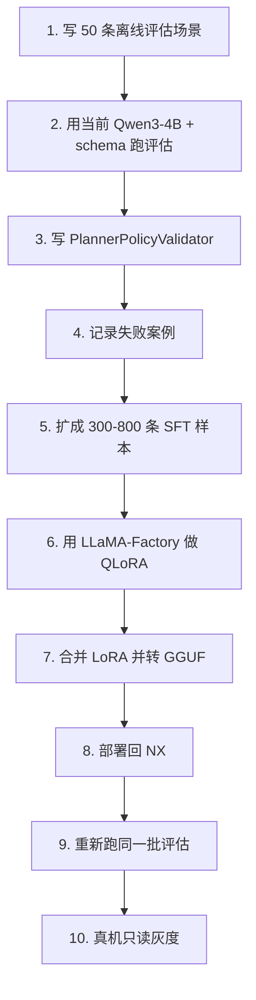

# 本地 LLM 的 SFT/LoRA 离线微调实操手册

本文档回答三个问题：

1. SFT 数据怎么来。
2. 怎么离线做 LoRA/QLoRA 微调。
3. 怎么把微调结果重新部署到 Jetson NX 上给 `llama.cpp` 使用。

核心判断：

**先不要在 NX 上训练。NX 只做推理验证和最终部署；SFT/LoRA 训练应在台式机 GPU、实验室服务器或临时云 GPU 上完成。**

---

## 1. 先分清三件事

### 1.1 SFT 是训练目标

SFT 的目标是让本地 LLM 学会：

```text
用户命令 + WorldState + 语义拓扑 + 工具列表
  -> 合法 JSON 策略计划
```

它学的是“策略格式和行为偏好”，不是学习地图。

### 1.2 LoRA/QLoRA 是训练方法

LoRA/QLoRA 的目标是低成本训练一个小 adapter：

```text
base model：冻结
LoRA adapter：训练
```

QLoRA 比 LoRA 更省显存，因为训练时会用 4bit 加载 base model。

### 1.3 GGUF 是部署格式，不是训练格式

当前 NX 上的模型是：

```text
/home/ysy/models/Qwen3-4B-Q4_K_M.gguf
```

这个是 `llama.cpp` 推理格式。一般不直接用 GGUF 做 SFT 训练。

训练时需要 Hugging Face 格式 base model，例如：

```text
Qwen/Qwen3-4B
或
Qwen/Qwen2.5-3B-Instruct
```

训练完成后再：

```text
LoRA adapter -> merge -> HF merged model -> convert to GGUF -> quantize -> Jetson NX
```

---

## 2. SFT 数据从哪里来

SFT 数据不是让模型自由聊天，而是一批标准机器人决策案例。

每条样本包含：

```text
输入：用户命令 + WorldState + 语义拓扑 + 工具列表 + 安全阈值
输出：符合 local_llm_plan.schema.json 的标准 JSON plan
```

### 2.1 第一批数据来源

优先从这些地方来：

1. 你已经在 NX 上写过的 prompt 场景。
2. 我们定义的有图导航、弱网、Mapless Scout、风险暂停等典型场景。
3. 真机或仿真运行中模型失败的案例。
4. 人工手写的标准答案。

NX 上已有历史 prompt：

```text
/home/ysy/01_clear_corridor_planner_prompt.txt
/home/ysy/02_person_blocking_path_planner_prompt.txt
/home/ysy/03_closed_glass_door_planner_prompt*.txt
/home/ysy/04_slippery_floor_planner_prompt.txt
/home/ysy/05_weak_network_low_battery_planner_prompt*.txt
```

这些不能直接当最终训练集，需要转换成新的工具计划格式。

### 2.2 第一版样本类型

第一版建议先做 50 到 100 条离线评估样本，再扩成 300 到 800 条 SFT 样本。

必须覆盖：

| 场景 | 标准策略 |
|---|---|
| 正常有图巡检 | `mapped_navigation` + `create_navigation_subgoal` |
| 目标点有人 | 去观察点或 `safe_hold`，不能直接靠近 |
| 路径上有人 | `wait_until` 或暂停 |
| 玻璃门关闭 | `safe_hold` / `request_human_confirm` |
| 地面湿滑 | 降低速度，保守导航 |
| 网络弱 | `semantic_only`，drop `raw_video` |
| 网络弱且电量低 | 请求人工确认或返回 |
| SLAM 健康 | 优先有图导航 |
| SLAM 退化 | 不下发远距离有图导航 |
| 无地图前出侦察 | `mapless_scout` |
| 返回置信度低 | 停止并请求人工确认 |
| 用户要求高速 | 拒绝或降速 |
| 用户要求穿越人群 | 拒绝或等待 |
| 工具不可用 | 换工具或请求人工 |

---

## 3. 单条 SFT 样本怎么写

推荐用 LLaMA-Factory 支持的 `sharegpt` 格式。

最小样本：

```json
{
  "conversations": [
    {
      "from": "user",
      "value": "User command: Inspect lab_door. If a person is present, wait.\n\nWorld state: {\"robot\":{\"localized\":true,\"battery_percent\":78},\"slam_status\":\"healthy\",\"link_quality\":{\"bandwidth_kbps\":90,\"latency_ms\":850},\"risk_events\":[{\"event_type\":\"human_near_target\",\"severity\":\"high\",\"node_id\":\"lab_door\",\"distance_m\":0.6}]}\n\nSemantic topology: {\"current_node\":\"start_area\",\"target_node\":\"lab_door\",\"safe_observation_node\":\"corridor_a\",\"candidate_path\":[\"start_area\",\"corridor_a\",\"lab_door\"]}\n\nRegistered tools: [\"set_communication_policy\",\"create_navigation_subgoal\",\"wait_until\",\"capture_keyframe\",\"request_human_confirm\",\"hold_position\"]\n\nOutput one JSON object matching local_llm_plan.schema.json."
    },
    {
      "from": "assistant",
      "value": "{\"plan_id\":\"inspect-lab-door-001\",\"mode\":\"mapped_navigation\",\"confidence\":0.86,\"reason\":\"SLAM is healthy but a person is near the target and the network is weak. Switch to semantic-only communication, move only to the safe observation node, then wait for the target to clear.\",\"steps\":[{\"step_id\":\"switch-low-bandwidth\",\"tool\":\"set_communication_policy\",\"arguments\":{\"mode\":\"semantic_only\",\"send\":[\"task_state\",\"risk_events\",\"keyframe\"],\"drop\":[\"raw_video\",\"dense_pointcloud\"],\"reason\":\"weak link\"}},{\"step_id\":\"go-observation-node\",\"tool\":\"create_navigation_subgoal\",\"arguments\":{\"goal_id\":\"go-corridor-a\",\"target_node\":\"corridor_a\",\"target_pose\":{\"x\":1.5,\"y\":0.3,\"yaw\":0.0},\"constraints\":{\"max_linear_speed_mps\":0.35,\"max_angular_speed_rps\":0.4,\"safety_mode\":\"conservative\"}}},{\"step_id\":\"wait-target-clear\",\"tool\":\"wait_until\",\"arguments\":{\"condition\":{\"type\":\"node_clear\",\"node_id\":\"lab_door\",\"category\":\"person\",\"min_clear_distance_m\":1.5},\"timeout_s\":30}}],\"communication_policy\":{\"mode\":\"semantic_only\",\"send\":[\"task_state\",\"risk_events\",\"keyframe\"],\"drop\":[\"raw_video\",\"dense_pointcloud\"],\"reason\":\"weak link\"},\"requires_human_ack\":false}"
    }
  ],
  "system": "You are the local strategy planner running on a quadruped robot edge computer. Output exactly one JSON object matching local_llm_plan.schema.json. Never output motor commands, velocity commands, raw slam_operate calls, shell commands, or configuration edits.",
  "tools": "Allowed tools: set_communication_policy, create_navigation_subgoal, wait_until, capture_keyframe, start_mapless_scout, request_human_confirm, hold_position."
}
```

注意：

1. Assistant 的 `value` 必须是一个 JSON 字符串。
2. 输出要能被 `schemas/local_llm_plan.schema.json` 校验通过。
3. 不要让模型输出 Markdown。
4. 不要把具体场地地图硬训练进权重，地图信息运行时注入。

---

## 4. 数据构造流程

当前仓库已经生成了一版比赛场景样本库：

```text
data/local_llm_sft/go2w_competition_planner_sft.json
data/local_llm_sft/go2w_competition_train.json
data/local_llm_sft/go2w_competition_val.json
data/local_llm_sft/go2w_competition_test.json
data/local_llm_eval/go2w_competition_eval.jsonl
```

重新生成：

```powershell
python E:\GO2W_0\scripts\generate_competition_llm_dataset.py
```

校验：

```powershell
python E:\GO2W_0\scripts\validate_local_llm_dataset.py
```

### 4.1 先做离线评估集

先写：

```text
data/local_llm_eval/scenarios.jsonl
```

每条包括：

```json
{
  "case_id": "risk_human_near_target_001",
  "user_command": "去实验室门口巡检，如果有人就等待。",
  "world_state": {},
  "semantic_topology": {},
  "registered_tools": [],
  "expected_policy": {
    "must_include_tools": ["set_communication_policy", "wait_until"],
    "must_not_include_tools": ["start_mapless_scout"],
    "expected_mode": "mapped_navigation"
  }
}
```

这一步不是训练，是用来测当前 Qwen3-4B 的稳定性。

### 4.2 再写 SFT 训练集

再写：

```text
data/local_llm_sft/train.json
data/local_llm_sft/val.json
```

建议拆分：

```text
train：80%
val：10%
test：10%
```

第一版规模：

```text
train 300 到 800 条
val 50 到 100 条
test 50 到 100 条
```

### 4.3 标注标准

每条输出都必须先经过：

```text
JSON parse
local_llm_plan.schema.json 校验
PlannerPolicyValidator 校验
```

不通过就不能进训练集。

---

## 5. 离线微调环境

推荐训练设备：

```text
台式机 GPU / 实验室服务器 / 临时云 GPU
```

不推荐：

```text
Jetson Orin NX 8GB 上训练
```

原因：

1. NX 内存紧张。
2. 训练会影响 ROS2/视觉/系统稳定性。
3. 训练时间长，不利于反复迭代。

---

## 6. 推荐训练工具：LLaMA-Factory

Qwen 官方文档给出的 LLaMA-Factory 路线支持单卡/多卡训练，并支持 full-parameter、LoRA、Q-LoRA、DoRA；自定义数据可用 `alpaca` 或 `sharegpt` 格式。官方训练示例使用 `--stage sft`、`--finetuning_type lora`，并给出 LoRA 合并导出命令。

参考：

- Qwen LLaMA-Factory 文档：<https://qwen.readthedocs.io/en/v3.0/training/llama_factory.html>
- llama.cpp LoRA 转 GGUF 脚本：<https://github.com/ggml-org/llama.cpp/blob/master/convert_lora_to_gguf.py>

---

## 7. LLaMA-Factory 数据注册

把训练数据放进 LLaMA-Factory 的 `data/` 目录，例如：

```text
LLaMA-Factory/data/go2w_planner_sft.json
```

在 `data/dataset_info.json` 里注册：

```json
{
  "go2w_planner_sft": {
    "file_name": "go2w_planner_sft.json",
    "formatting": "sharegpt",
    "columns": {
      "messages": "conversations",
      "system": "system",
      "tools": "tools"
    },
    "tags": {
      "role_tag": "from",
      "content_tag": "value",
      "user_tag": "user",
      "assistant_tag": "assistant"
    }
  }
}
```

---

## 8. QLoRA 训练配置草案

配置文件可参考：

```text
configs/llamafactory/go2w_qwen3_lora_sft.yaml
```

核心参数建议：

```yaml
stage: sft
do_train: true
model_name_or_path: Qwen/Qwen3-4B
dataset: go2w_planner_sft
template: qwen
finetuning_type: lora
quantization_bit: 4
lora_rank: 16
lora_alpha: 32
lora_dropout: 0.05
lora_target: q_proj,v_proj,k_proj,o_proj
output_dir: saves/qwen3-4b/lora/go2w-planner
overwrite_output_dir: true
per_device_train_batch_size: 1
gradient_accumulation_steps: 8
learning_rate: 2.0e-5
num_train_epochs: 3
lr_scheduler_type: cosine
warmup_ratio: 0.03
cutoff_len: 2048
bf16: true
logging_steps: 5
save_steps: 100
plot_loss: true
```

说明：

1. 如果 LLaMA-Factory 版本支持 `template: qwen3`，可以改成 `qwen3`。
2. 如果显存较小，降低 `cutoff_len` 或增大 `gradient_accumulation_steps`。
3. 如果训练不稳定，先只训练 `q_proj,v_proj`。
4. 第一版不要追求大 epoch，先看验证集是否稳定。

运行：

```bash
llamafactory-cli train configs/llamafactory/go2w_qwen3_lora_sft.yaml
```

---

## 9. 导出 LoRA

训练完成后导出合并模型：

```bash
llamafactory-cli export \
  --model_name_or_path Qwen/Qwen3-4B \
  --adapter_name_or_path saves/qwen3-4b/lora/go2w-planner \
  --template qwen \
  --finetuning_type lora \
  --export_dir exports/qwen3-4b-go2w-planner-merged \
  --export_size 2 \
  --export_legacy_format false
```

如果你的 LLaMA-Factory 版本支持 `template qwen3`，保持和训练一致。

---

## 10. 转 GGUF 与量化

合并后的 HF 模型需要转成 GGUF。

在 llama.cpp 环境中：

```bash
python convert_hf_to_gguf.py \
  exports/qwen3-4b-go2w-planner-merged \
  --outfile qwen3-4b-go2w-planner-f16.gguf \
  --outtype f16
```

再量化：

```bash
./build/bin/llama-quantize \
  qwen3-4b-go2w-planner-f16.gguf \
  qwen3-4b-go2w-planner-Q4_K_M.gguf \
  Q4_K_M
```

部署到 NX：

```text
/home/ysy/models/qwen3-4b-go2w-planner-Q4_K_M.gguf
```

然后用 `llama.cpp` 跑离线评估。

---

## 11. 如果只想加载 LoRA 而不合并

llama.cpp 也有 LoRA adapter 转 GGUF 工具：

```bash
python convert_lora_to_gguf.py \
  path/to/lora_adapter \
  --base path/to/base_hf_model \
  --outfile go2w-planner-lora.gguf
```

但比赛部署建议优先用合并并量化后的单一 GGUF：

```text
更简单
更少运行时变量
更容易复现实验
```

---

## 12. 微调前必须先做的评估

不要直接训练。先用当前 NX 上的 Qwen3-4B 跑 50 到 100 条场景。

指标：

| 指标 | 第一阶段目标 |
|---|---:|
| JSON 可解析率 | >= 99% |
| schema 通过率 | >= 99% |
| 工具合法率 | >= 99% |
| 危险场景保守率 | >= 95% |
| 弱网策略正确率 | >= 95% |
| SLAM 退化处理正确率 | >= 95% |

如果当前模型加 schema 和 validator 后已经达标，可以先不微调。

如果不达标，再做 LoRA。

---

## 13. 微调后怎么判断有效

对比三组：

```text
A: 原始 Qwen3-4B + prompt
B: 原始 Qwen3-4B + prompt + json-schema + validator
C: LoRA 后模型 + json-schema + validator
```

只有当 C 在下面指标上明显优于 B，微调才算有价值：

```text
危险场景保守率
弱网策略正确率
SLAM 退化处理正确率
工具参数完整率
重试次数
平均输出长度
平均延迟
```

---

## 14. 当前最推荐的执行顺序



---

## 15. 一句话总结

你现在要做的不是“立刻训练模型”，而是先把训练标准建立起来：

```text
先定义正确答案
再评估当前模型
再收集失败样本
最后用 LoRA/QLoRA 微调修正策略偏好
```

SFT 数据来自机器人任务场景，LoRA 训练在离线 GPU 上完成，最终模型转成 GGUF 回到 NX 上用 `llama.cpp` 部署。
