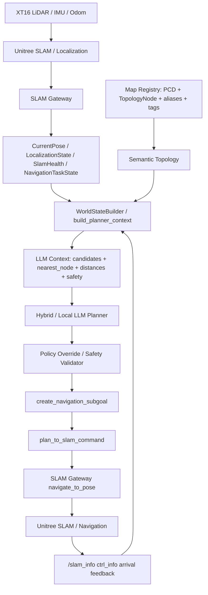

# 语义闭环汇报口径

## 一句话结论

不要把系统讲成“SLAM 自动变成语义”，更准确的说法是：

> SLAM 负责几何定位、地图坐标和导航反馈；语义层把地图坐标绑定成“工位、办公室门口、走廊”等拓扑节点；WorldStateBuilder 把 SLAM 状态、语义拓扑和安全状态压缩成结构化摘要；本地 LLM 只在这个摘要上做低频任务规划，最后由安全层校验后再转回 SLAM 导航命令。

也就是：

```text
几何定位不是语义。
语义来自人工标注、拓扑注册和后续感知适配。
LLM 不看原始 PCD，也不直接控制底盘。
```

## 闭环总流程



## 1. SLAM 怎么定位

底层仍然使用 GO2W 官方 `unitree_slam`。它加载当前真实 PCD 地图，例如：

```text
/home/unitree/test.pcd
```

SLAM 的职责是用雷达点云、里程计和自身状态，在 PCD 地图坐标系里估计机器人当前位姿，并输出重定位 / 跟踪状态。我们当前主要读取这些状态：

| 信息 | 来源 | 作用 |
|---|---|---|
| 当前位姿 | `/unitree/slam_relocation/odom` | 得到 `x/y/z/yaw` |
| SLAM 状态 | `/slam_info` | 判断地图、定位、导航状态 |
| 到达反馈 | `/slam_info ctrl_info` | 判断是否到点 |
| 点云在线状态 | `/unitree/slam_lidar/points` | 判断雷达输入是否正常 |

在代码里，`llm_context.py` 的 `_pose_dict_from_snapshot()` 会从 `relocation_odom` 取当前位姿。只有满足：

```text
health_status == ok
localization_status == localized_or_tracking
pose != None
```

系统才认为可以进入 mapped navigation。否则只能 `hold_position` 或请求人工确认。

## 2. SLAM 怎么转换成语义

严格说，SLAM 本身不转换语义。

SLAM 只知道：

```text
map frame 里的坐标
当前位置
目标坐标
导航状态
```

语义来自 `Map Registry`。我们把 PCD 地图上的点登记为拓扑节点，每个节点同时包含：

| 字段 | 含义 |
|---|---|
| `node_id` | 稳定英文 ID，例如 `zhao_bo_office_front` |
| `name` | 中文语义名，例如 `赵博办公室门口` |
| `aliases` | 用户可能说出的别名，例如 `赵博办公室`、`赵博门口` |
| `tags` | 任务属性，例如 `office`、`photo_required`、`needs_calibration` |
| `pose` | SLAM 地图坐标系中的目标位姿 |

所以真实含义是：

```text
PCD 提供几何地图。
pose 提供目标坐标。
name / aliases / tags 提供语义。
```

例如：

```text
用户说“去赵博办公室门口”
    ↓
匹配 registry 中的中文 name / aliases
    ↓
得到 node_id = zhao_bo_office_front
    ↓
再拿它绑定的 SLAM pose 去导航
```

当前 registry 文件：

```text
E:\GO2W_0\configs\maps\go2w_real_site_map_registry.json
```

对应代码：

```text
E:\GO2W_0\src\edge_autonomy\map_registry.py
```

其中 `TopologyNode` 就是语义节点，`navigate_to_node_command()` 会把语义节点转换成底层 `navigate_to_pose` 命令。

## 3. 语义怎么传递到 LLM

LLM 不直接读 PCD，也不读原始点云。它拿到的是压缩后的结构化上下文。

第一层由 `build_planner_context()` 生成完整 `world_state_summary`，里面包括：

```text
map: 当前 map_id、pcd_path、frame_id
robot: 当前 pose、nearest_node、localized
slam: health_status、localization_status、进程状态
lidar: 点云是否在线、点数、频率
topology: available_nodes、edges
allowed_actions: 当前允许的动作
```

第二层由 `build_lightweight_planner_context()` 再压缩成适合本地模型的小上下文：

```text
user_command
map_id
slam_ok
localized
nearest_node
requested_target_guess
distance_to_requested_target_m
arrival_distance_m
battery_percent
bandwidth_kbps
candidates
```

其中 `candidates` 是 LLM 看到的语义候选点，例如：

```text
node_id
name
aliases
tags
distance_m
photo_required
door_may_close
```

这就是“从 SLAM 到语义再到 LLM”的关键桥梁：

```text
SLAM pose
    + registry semantic topology
    + safety / battery / link state
    = WorldState summary
    -> LLM planner input
```

## 4. LLM 输出怎么回到底盘

LLM 或 hybrid planner 不能直接输出底盘速度，也不能直接调用 Unitree 原始 API。它只能输出受约束的工具调用，例如：

```text
safe_hold
human_confirm
mapped_navigation
```

如果要导航，计划中必须是：

```json
{
  "tool": "create_navigation_subgoal",
  "arguments": {
    "map_id": "go2w_real_site",
    "target_node": "zhao_bo_office_front"
  }
}
```

然后 `plan_to_slam_command()` 再根据 `target_node` 查 registry，生成真正的底层命令：

```json
{
  "action": "navigate_to_pose",
  "map_id": "go2w_real_site",
  "target_node": "zhao_bo_office_front",
  "target_pose": {
    "x": "...",
    "y": "...",
    "yaw": "...",
    "speed": 0.3,
    "mode": 1
  }
}
```

最后由 `SLAM Gateway` 发给 `unitree_slam` 执行。

## 5. 安全层为什么必须独立

比赛汇报时要强调：LLM 只是任务规划层，不是安全闭环。

当前策略是：

| 场景 | 系统行为 |
|---|---|
| 目标不在 registry | 强制 `human_confirm`，禁止导航 |
| 已经在目标附近 | 强制 `hold_position`，禁止重复导航 |
| 低电量 | 强制人工确认或回充 |
| 弱网 | 先切换 `semantic_only`，丢弃原始视频和密集点云 |
| SLAM 未定位 | 强制 `hold_position` 或重定位 |

这样可以证明：

```text
LLM 不能凭空编点。
LLM 不能越过定位状态直接开走。
LLM 输出后还有 PolicyValidator / SafetySupervisor 二次审核。
```

## 6. 答辩时建议这样讲

推荐表述：

> 底层 SLAM 解决“我在哪里”和“怎么到某个坐标”；语义层解决“这个坐标代表哪个办公室、工位或巡检任务”；LLM 不直接看原始点云，而是看由 SLAM 状态、语义拓扑、安全状态压缩成的 WorldState；LLM 输出的是受约束的工具调用，最终还要经过安全策略校验，再转成 SLAM Gateway 的导航命令。

更短的版本：

> 我们不是让大模型控制机器狗，而是让大模型在一个可验证的语义地图和实时状态摘要上做任务级决策，底层定位、导航和安全仍由确定性模块闭环。

## 7. 不要这样讲

避免这些说法：

```text
SLAM 自动识别赵博办公室。
PCD 本身就是语义地图。
LLM 直接控制底盘。
LLM 直接读取全部点云。
任意中文地点都可以自动导航。
```

应改成：

```text
PCD 是几何地图。
registry 是语义拓扑层。
WorldState 是给 LLM 的结构化输入。
LLM 输出的是受约束的任务级工具调用。
底层执行前必须经过安全校验。
```

## 8. 当前阶段的边界

当前已经具备的是：

```text
拓扑语义闭环：
中文目标 -> registry 匹配 -> WorldState -> LLM / hybrid plan -> policy override -> SLAM command
```

当前还在完善的是：

```text
感知语义闭环：
RGB-D / LiDAR / mmWave -> 物体、门状态、动态障碍 -> RiskEvent / SemanticObject -> LLM 或安全层
```

所以研电赛当前主线建议讲：

> 已完成基于拓扑语义的本地 SLAM 任务闭环，正在扩展多传感器感知语义，用于门状态、动态行人和风险事件的结构化上报。
