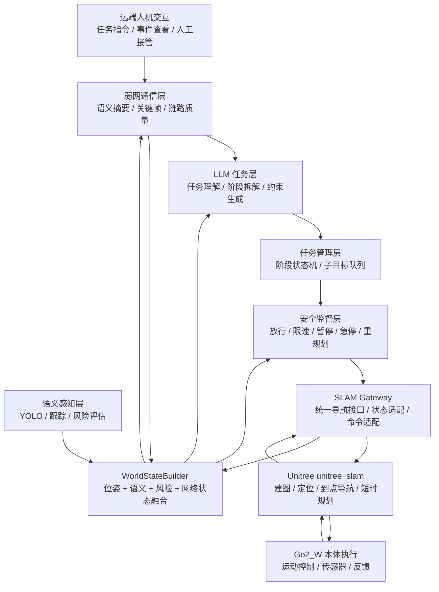
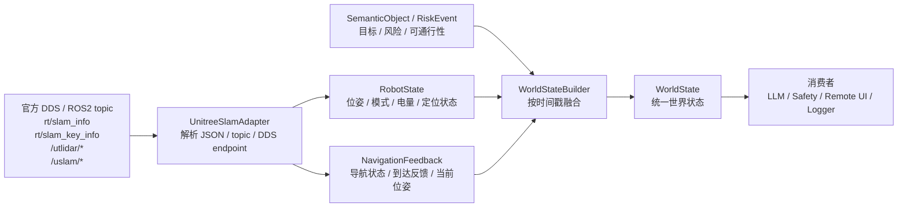
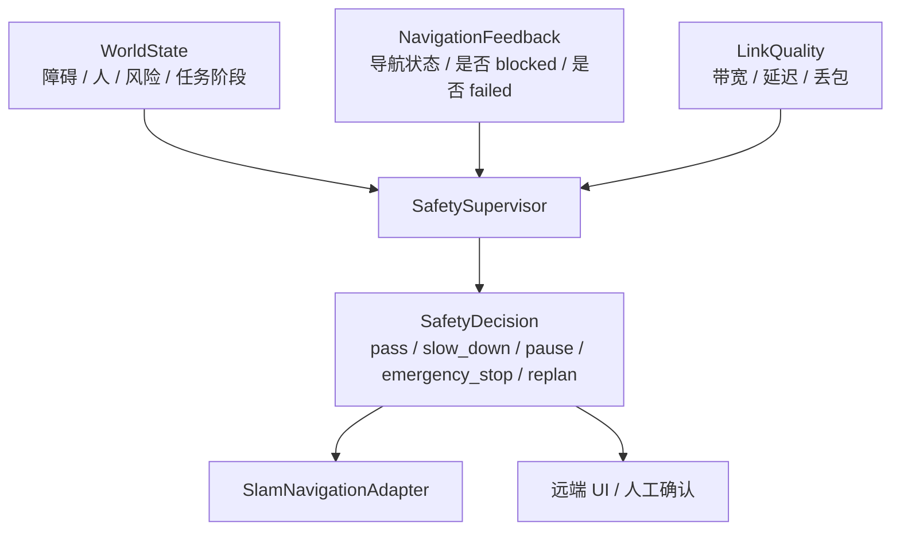
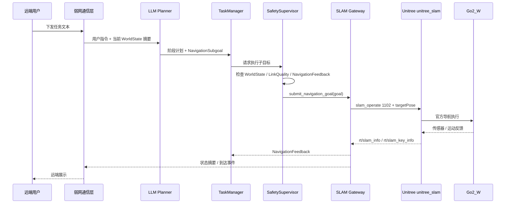
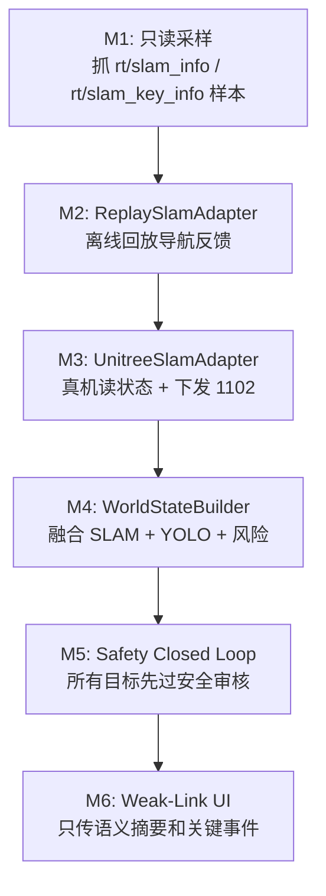

# SLAM Gateway 流程图与协议说明

本文档的目标是把 GO2W 项目里的 SLAM 相关模块讲清楚：我们不是重写宇树 SLAM，而是在官方 `unitree_slam` 外面建立一个稳定的 `SLAM Gateway`。上层语义、LLM、弱网交互和安全监督只依赖我们自己的协议，不直接依赖宇树 topic、DDS service 或 API ID。

---

## 1. 一句话定位

`SLAM Gateway` 是官方 SLAM / Navigation 和自研语义自治系统之间的隔离层。

它负责三件事：

1. 读取官方 SLAM / 激光 / 机器人状态。
2. 统一成项目内部的 `RobotState`、`NavigationFeedback`、`WorldState`。
3. 把上层的 `NavigationSubgoal` 转换成宇树 `slam_operate` 请求。

它不负责：

1. 重写建图算法。
2. 重写局部路径规划。
3. 直接控制电机或持续输出速度。

---

## 2. 总体架构图



读图方式：

1. 下行链路是任务执行：人下发任务，最后变成官方导航目标。
2. 上行链路是状态理解：机器人状态、SLAM 状态、语义目标和风险事件汇总成 `WorldState`。
3. 安全监督层横在任务和导航之间，任何目标都必须先过它。

---

## 3. 三条核心流程

### 3.1 状态上行流程



目标：所有上层模块都读 `WorldState`，不要直接订阅 `/utlidar/cloud`、`rt/slam_info` 这类底层接口。

### 3.2 任务下发流程


目标：LLM 不直接写 `slam_operate`，也不直接输出速度。LLM 只输出结构化子目标和约束。

### 3.3 安全闭环流程



目标：安全监督层独立于 LLM。即使 LLM 给出目标，安全层也可以暂停、限速、急停或要求人工确认。

---

## 4. 一次“到点导航”的时序图



关键点：

1. `LLM Planner` 只做高层任务，不碰底层导航 API。
2. `SafetySupervisor` 是最后审批者。
3. `SLAM Gateway` 是唯一知道宇树 `slam_operate` 细节的模块。

---

## 5. 外部接口：宇树当前可复用内容

这部分来自当前机器 `unitree@192.168.3.17` 的只读摸底记录。

### 5.1 官方部署包

| 项目 | 当前值 | 用途 |
|---|---|---|
| SLAM 部署目录 | `/unitree/module/unitree_slam` | 官方 SLAM / Navigation 二进制包 |
| 主二进制 | `bin/unitree_slam` | 官方 SLAM 主程序 |
| 示例程序 | `example/src/keyDemo.cpp` | 暴露 `slam_operate` 用法 |
| SDK 目录 | `/home/unitree/unitree_sdk2` | DDS / Unitree API 调用基础 |

### 5.2 DDS topic

| 外部接口 | 方向 | 内容 | 我们内部映射 |
|---|---|---|---|
| `rt/slam_info` | 订阅 | 当前位姿、定位状态等 JSON | `RobotState.pose`、`NavigationFeedback.pose` |
| `rt/slam_key_info` | 订阅 | 任务结果、是否到达 | `NavigationFeedback.status` |
| `/utlidar/cloud` | 订阅 | 点云 | 语义/风险层可选输入 |
| `/utlidar/robot_pose` | 订阅 | 机器人位姿 | `RobotState.pose` 备选来源 |
| `/utlidar/robot_odom` | 订阅 | 里程计 | 状态估计备选输入 |
| `/uslam/localization/odom` | 订阅 | 定位里程计 | `RobotState.pose` 备选来源 |
| `/uslam/navigation/global_path` | 订阅 | 全局路径 | 远端展示 / 风险检查 |

### 5.3 `slam_operate` API ID

| API ID | 外部含义 | 内部函数 |
|---:|---|---|
| `1801` | 开始建图 | `start_mapping()`，后期再接 |
| `1802` | 结束建图 | `finish_mapping()`，后期再接 |
| `1804` | 开始重定位 | `start_relocation()`，后期再接 |
| `1102` | 目标位姿导航 | `submit_navigation_goal(goal)` |
| `1201` | 暂停导航 | `pause_navigation()` |
| `1202` | 恢复导航 | `resume_navigation()` |
| `1901` | 停止节点 | 不作为常规业务接口，谨慎使用 |

工程原则：上层代码不能直接出现 `1102`、`1201` 这类数字 ID。它们只允许出现在 `UnitreeSlamAdapter` 内部。

---

## 6. 内部协议：稳定数据模型

内部协议是项目自己的“语言”。后面即使底层从宇树官方导航换成 Nav2、LIO-SAM 或混合方案，上层也应该继续使用这些模型。

### 6.1 `Pose2D`

| 字段 | 类型 | 含义 |
|---|---|---|
| `x` | number | 地图坐标系下的 x，单位 m |
| `y` | number | 地图坐标系下的 y，单位 m |
| `yaw` | number | 朝向角，单位 rad |

说明：宇树 `slam_info` 里是四元数 `q_x/q_y/q_z/q_w`，适配层负责转成 `yaw`。

### 6.2 `RobotState`

| 字段 | 类型 | 含义 |
|---|---|---|
| `pose` | `Pose2D` | 当前机器人位姿 |
| `mode` | string | 当前模式，例如 `standby`、`autonomy`、`navigation` |
| `battery_percent` | number | 电量百分比 |
| `localized` | boolean | 是否认为定位可靠 |

### 6.3 `NavigationSubgoal`

这是 LLM / TaskManager 输出的“意图级子目标”。

| 字段 | 类型 | 含义 |
|---|---|---|
| `goal_id` | string | 子目标 ID |
| `target_pose` | `Pose2D` | 目标位姿 |
| `constraints.max_linear_speed_mps` | number | 最大线速度 |
| `constraints.max_angular_speed_rps` | number | 最大角速度 |
| `constraints.avoid_regions` | string[] | 要避开的语义区域 ID |
| `constraints.safety_mode` | string | `normal`、`conservative`、`halt_on_risk` |

示例：

```json
{
  "goal_id": "inspect-door-001",
  "target_pose": {
    "x": 3.2,
    "y": -1.4,
    "yaw": 1.57
  },
  "constraints": {
    "max_linear_speed_mps": 0.5,
    "max_angular_speed_rps": 0.4,
    "avoid_regions": ["wet-floor-zone"],
    "safety_mode": "conservative"
  }
}
```

### 6.4 `NavigationGoal`

这是通过安全审核后，真正交给 `SLAM Gateway` 的“可执行目标”。

| 字段 | 类型 | 含义 |
|---|---|---|
| `goal_id` | string | 目标 ID |
| `target_pose` | `Pose2D` | 目标位姿 |
| `max_linear_speed_mps` | number | 最终执行线速度上限 |
| `max_angular_speed_rps` | number | 最终执行角速度上限 |
| `safety_mode` | string | 最终安全模式 |

`NavigationSubgoal` 和 `NavigationGoal` 的区别：

1. `NavigationSubgoal` 是任务层意图。
2. `NavigationGoal` 是安全层审核后的执行指令。

### 6.5 `NavigationFeedback`

| 字段 | 类型 | 含义 |
|---|---|---|
| `status` | string | `idle`、`navigating`、`goal_reached`、`blocked`、`failed`、`canceled` |
| `pose` | `Pose2D` | 当前位姿 |
| `distance_to_goal_m` | number/null | 距离目标点估计 |
| `message` | string | 后端状态说明 |

状态映射建议：

| 宇树信息 | 内部状态 |
|---|---|
| `rt/slam_key_info.data.is_arrived == true` | `goal_reached` |
| 正在执行 `1102` 目标 | `navigating` |
| 导航失败或服务返回错误 | `failed` |
| 前方阻塞或安全层要求重规划 | `blocked` |
| 安全层或人工取消 | `canceled` |

### 6.6 `SemanticObject`

| 字段 | 类型 | 含义 |
|---|---|---|
| `object_id` | string | 目标 ID |
| `category` | string | 类别，例如 `person`、`door`、`vehicle` |
| `pose` | `Pose2D` | 目标在地图系下的位置 |
| `distance_m` | number | 相对机器人距离 |
| `risk_level` | string | `low`、`medium`、`high`、`critical` |
| `traversable` | boolean | 是否可通行 |
| `is_dynamic` | boolean | 是否动态目标 |
| `velocity_mps` | number | 估计速度 |

### 6.7 `RiskEvent`

| 字段 | 类型 | 含义 |
|---|---|---|
| `event_type` | string | 事件类型，例如 `human_near_path` |
| `severity` | string | `low`、`medium`、`high`、`critical` |
| `description` | string | 给人和日志看的解释 |
| `distance_m` | number/null | 事件距离 |

### 6.8 `WorldState`

这是系统最核心的共享状态。

| 字段 | 类型 | 含义 |
|---|---|---|
| `timestamp_ms` | integer | 状态生成时间 |
| `frame_id` | string | 坐标系，通常是 `map` |
| `robot` | `RobotState` | 机器人状态 |
| `objects` | `SemanticObject[]` | 结构化目标列表 |
| `risk_events` | `RiskEvent[]` | 风险事件列表 |
| `task_phase` | string | 当前任务阶段 |
| `map_reference` | `MapReference/null` | 当前地图引用 |

示例：

```json
{
  "timestamp_ms": 1760000000000,
  "frame_id": "map",
  "robot": {
    "pose": {
      "x": 1.0,
      "y": 2.0,
      "yaw": 0.2
    },
    "mode": "navigation",
    "battery_percent": 82.0,
    "localized": true
  },
  "objects": [
    {
      "object_id": "person-001",
      "category": "person",
      "pose": {
        "x": 2.2,
        "y": 2.4,
        "yaw": 0.0
      },
      "distance_m": 1.3,
      "risk_level": "high",
      "traversable": false,
      "is_dynamic": true,
      "velocity_mps": 0.4
    }
  ],
  "risk_events": [
    {
      "event_type": "human_near_path",
      "severity": "high",
      "description": "person entered planned path corridor",
      "distance_m": 1.3
    }
  ],
  "task_phase": "navigate_to_checkpoint",
  "map_reference": {
    "map_id": "lab-floor-1",
    "frame_id": "map",
    "version": "2026-04-24"
  }
}
```

### 6.9 `SafetyDecision`

| 字段 | 类型 | 含义 |
|---|---|---|
| `action` | string | `pass_through`、`slow_down`、`pause`、`emergency_stop`、`request_replan`、`takeover` |
| `reason` | string | 决策原因 |
| `speed_limit_scale` | number | 速度缩放，`0.0` 表示停止 |
| `requires_human_ack` | boolean | 是否需要人工确认 |

---

## 7. 宇树请求映射

`NavigationGoal` 到 `slam_operate 1102` 的映射如下：

| 内部字段 | 宇树请求字段 |
|---|---|
| `goal.target_pose.x` | `data.targetPose.x` |
| `goal.target_pose.y` | `data.targetPose.y` |
| `goal.target_pose.yaw` | 转四元数后写入 `q_x/q_y/q_z/q_w` |
| `goal.safety_mode` | 可映射到 `data.mode` 或内部限速策略 |
| `goal.max_linear_speed_mps` | `data.speed` 或安全层速度约束 |

内部目标：

```json
{
  "goal_id": "checkpoint-1",
  "target_pose": {
    "x": 2.0,
    "y": 0.5,
    "yaw": 0.0
  },
  "max_linear_speed_mps": 0.5,
  "max_angular_speed_rps": 0.4,
  "safety_mode": "normal"
}
```

适配层生成的宇树请求语义：

```json
{
  "api_id": 1102,
  "service": "slam_operate",
  "data": {
    "targetPose": {
      "x": 2.0,
      "y": 0.5,
      "z": 0.0,
      "q_x": 0.0,
      "q_y": 0.0,
      "q_z": 0.0,
      "q_w": 1.0
    },
    "mode": "normal",
    "speed": 0.5
  }
}
```

注意：上面是项目内文档化的语义结构，真实 SDK 调用时要按 `unitree_sdk2` 的 `slam_operate` Client 封装发送。

---

## 8. 模块职责边界

### 8.1 `models.py`

职责：

1. 定义内部稳定协议。
2. 不导入 ROS2、DDS、Unitree SDK。
3. 可以被 LLM、远端、测试、安全层共同引用。

### 8.2 `slam_adapter.py`

职责：

1. 定义 `SlamNavigationAdapter` 抽象接口。
2. 提供 `InMemorySlamAdapter` 或 `ReplaySlamAdapter`，方便离线测试。
3. 不直接写死宇树 API ID。

### 8.3 `unitree_slam_adapter.py`

职责：

1. 订阅 `rt/slam_info`、`rt/slam_key_info`。
2. 调用 `slam_operate`。
3. 完成四元数和 `Pose2D` 的转换。
4. 把宇树状态映射成 `NavigationFeedback`。

这是唯一允许直接接触宇树 SLAM 细节的模块。

### 8.4 `world_state_builder.py`

职责：

1. 读取 `RobotState`、`NavigationFeedback`。
2. 合并 YOLO / 跟踪 / 风险检测结果。
3. 合并网络状态和任务阶段。
4. 输出 `WorldState`。

### 8.5 `safety.py`

职责：

1. 根据 `WorldState`、`NavigationFeedback`、`LinkQuality` 做最终裁决。
2. 输出 `SafetyDecision`。
3. 不直接调用宇树 API，由 TaskManager 或 Gateway 执行对应动作。

### 8.6 `task_manager.py`

职责：

1. 管理任务阶段。
2. 把 LLM 输出的阶段计划变成 `NavigationSubgoal` 队列。
3. 根据反馈推进状态机。
4. 遇到 `blocked`、`failed`、`emergency_stop` 时暂停或请求重规划。

---

## 9. 第一版落地顺序



每个阶段的完成标准：

| 阶段 | 完成标准 |
|---|---|
| M1 | 有真实 `slam_info` / `slam_key_info` JSON 样本 |
| M2 | 不连机器狗也能跑通 `NavigationFeedback` 回放测试 |
| M3 | 真机能读取位姿，并能下发一个低速目标点 |
| M4 | 能输出包含机器人、目标、风险事件的 `WorldState` |
| M5 | 人靠近路径时能暂停或要求重规划 |
| M6 | 弱网下远端仍能看到任务状态、风险事件和关键帧 |

---

## 10. 最小测试清单

### 10.1 离线测试

| 测试 | 目的 |
|---|---|
| `Pose2D` 和四元数互转 | 保证目标朝向不会错 |
| `slam_info` JSON 解析 | 保证真机状态能变成 `RobotState` |
| `slam_key_info` JSON 解析 | 保证到达事件能变成 `NavigationFeedback` |
| `WorldState` schema 校验 | 保证远端和 LLM 消费的是稳定格式 |
| `SafetySupervisor` 单元测试 | 保证风险事件能触发暂停/急停 |

### 10.2 真机只读测试

| 测试 | 目的 |
|---|---|
| 订阅 `rt/slam_info` | 确认定位状态持续更新 |
| 订阅 `rt/slam_key_info` | 确认导航任务结果可观察 |
| 观察 `/utlidar/robot_pose` | 确认可作为位姿备选来源 |
| 观察 `/uslam/navigation/global_path` | 确认可用于远端路径展示 |

### 10.3 真机执行测试

这部分会让机器狗真实运动，必须人工在旁确认，场地要空旷，并且先保证急停和遥控接管可用。

| 测试 | 目的 |
|---|---|
| 低速短距离 `1102` 到点 | 验证 `submit_navigation_goal` |
| `1201` 暂停 | 验证安全层可中断 |
| `1202` 恢复 | 验证任务可继续 |
| 人为制造弱网 | 验证安全层进入保守模式 |

---

## 11. 当前最重要的边界

1. `unitree_slam` 是底层能力，不是第一阶段改造对象。
2. `SLAM Gateway` 是接口隔离层，是当前最应该先做的模块。
3. `WorldState` 是上层共同语言，LLM、远端、安全监督都围绕它工作。
4. 所有导航命令都必须先过 `SafetySupervisor`。
5. 弱网环境下传语义、事件和关键帧，不传连续高清视频作为主链路。
