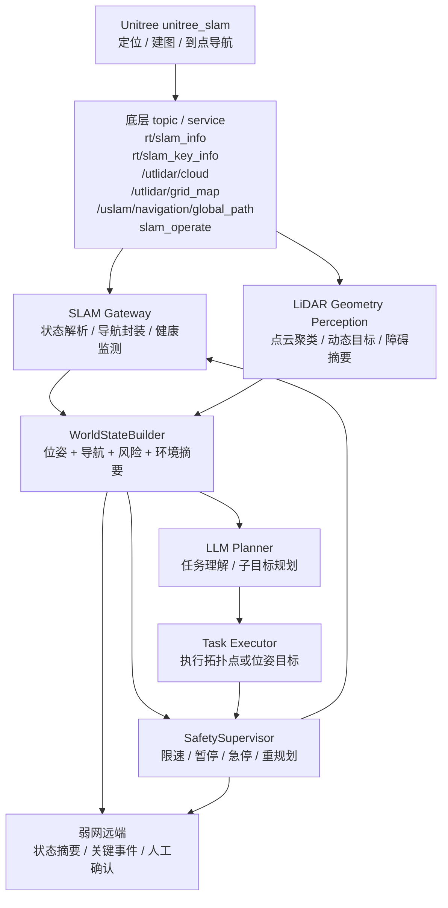
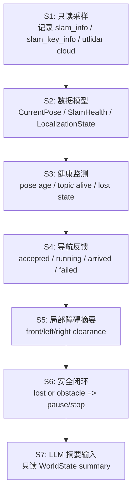

# SLAM 重构输出协议与 LiDAR 几何感知设计

本文档用于指导当前 GO2W 项目的 SLAM 应用重构。

它整合了两部分内容：

1. 在没有双目相机的情况下，SLAM 应该向上层稳定提供哪些输出。
2. 机器狗自带激光雷达能不能做目标识别，以及应该怎样工程化接入。

本文档的核心判断是：

> 当前阶段不要把 SLAM 改造成“万能语义理解模块”。SLAM 应该稳定提供几何定位、可通行性、导航反馈和置信度；目标识别应先做成基于 LiDAR 的几何目标检测与动态障碍跟踪；LLM 只消费压缩后的结构化世界状态。

---

## 1. 当前约束与设计边界

### 1.1 已知机器狗条件

根据当前机器狗摸底结果，项目应按以下条件设计：

| 条件 | 对设计的影响 |
|---|---|
| 当前主要依赖官方 `unitree_slam` 部署包 | 第一阶段不直接改官方 SLAM 内核，先做外部适配层 |
| 官方 SLAM 是二进制部署形态 | 需要通过 topic、DDS service、配置文件和运行态输出接入 |
| 已观察到 LiDAR、IMU、里程计、SLAM 位姿和导航路径相关 topic | 可以先做状态封装、定位健康监测和导航反馈 |
| 没有双目相机作为可靠输入 | 不应依赖视觉深度或视觉语义来完成基础导航闭环 |
| NX 上还要运行本地 LLM、通信和感知 | 不能把重模型全部堆到本体侧实时链路里 |
| 项目目标包含弱带宽远程交互 | 上层应传语义摘要、风险事件和关键帧，不应传连续大流量点云 |

### 1.2 本文档暂不展开的内容

以下内容先按下不表，只保留接口位置：

1. 多 PCD 地图切换。
2. 基于拓扑点的跨房间导航。
3. 701、走廊、门口等空间语义图谱。
4. LLM 微调样本库扩充。

原因是：这些能力都依赖底层 SLAM 的基础输出已经稳定。当前第一目标应是让系统可靠回答：

```text
我在哪里？
我定位是否可靠？
我附近能不能走？
我发出的导航目标有没有被执行？
我有没有到达目标点？
```

### 1.3 重构原则

本次 SLAM 应用重构建议遵循四条原则：

1. 官方 SLAM 只作为底层导航与定位能力，不直接向 LLM 暴露。
2. 自研 `SLAM Gateway` 是唯一接触官方 SLAM 细节的模块。
3. 上层统一读取 `WorldState`，不要到处直接订阅 `/utlidar/*`、`/uslam/*` 或 `rt/slam_info`。
4. LiDAR 目标识别第一版只做几何检测、动态跟踪和风险判断，不做强语义分类。

---

## 2. 推荐总体架构



读图重点：

1. `SLAM Gateway` 负责把官方接口变成项目内部协议。
2. `LiDAR Geometry Perception` 负责从点云里提取障碍、动态目标和通行风险。
3. `WorldStateBuilder` 负责把状态整理成 LLM、安全层和远端都能用的统一格式。
4. `SafetySupervisor` 永远在执行前做最后放行。
5. `LLM Planner` 不直接调用 `slam_operate`，也不直接输出速度控制。

---

## 3. SLAM 模块应该负责什么

### 3.1 应该负责

SLAM 相关模块应该稳定提供：

1. 当前位姿。
2. 当前地图引用。
3. 定位是否成功。
4. 定位是否可靠。
5. SLAM 输入链路是否活着。
6. 当前导航任务状态。
7. 目标点是否到达。
8. 距离目标点的估计距离。
9. 局部可通行状态。
10. 全局路径摘要。

### 3.2 不应该负责

SLAM 相关模块不应该直接负责：

1. 理解自然语言。
2. 判断“701 门口”“实验台”“走廊尽头”的语义。
3. 判断物体的视觉类别，比如“红色箱子”“某个人”“设备型号”。
4. 决定弱网下传什么图片。
5. 决定任务是否符合比赛策略。
6. 绕过安全层直接执行 LLM 的命令。

这些职责应分别交给：

| 职责 | 推荐模块 |
|---|---|
| 自然语言理解和任务拆解 | `LLM Planner` |
| 空间、房间、拓扑点管理 | `Semantic MapManager` |
| 安全放行、暂停、急停 | `SafetySupervisor` |
| LiDAR 障碍和动态目标 | `LiDAR Geometry Perception` |
| 远端摘要和关键帧策略 | `Weak-Bandwidth Interaction` |

---

## 4. SLAM 应输出的数据清单

### 4.1 优先级总表

| 输出 | 优先级 | 是否实时 | 建议频率 | 主要消费者 |
|---|---:|---|---|---|
| `CurrentPose` 当前位姿 | P0 | 是 | 10-30 Hz 底层，2-10 Hz 任务层 | 导航、安全、日志 |
| `LocalizationState` 定位状态 | P0 | 是 | 2-10 Hz | 安全、任务层、LLM 摘要 |
| `SlamHealth` SLAM 健康状态 | P0 | 是 | 1-5 Hz | 安全、调试、远端 |
| `NavigationTaskState` 导航任务状态 | P0 | 是或事件触发 | 2-10 Hz / 事件 | 任务层、安全、远端 |
| `MapState` 当前地图状态 | P1 | 半实时 | 0.5-2 Hz / 事件 | MapManager、LLM 摘要 |
| `LocalObstacleSummary` 局部障碍摘要 | P1 | 是 | 5-20 Hz 底层，1-5 Hz 任务层 | 安全、导航、LLM 摘要 |
| `GlobalPathSummary` 全局路径摘要 | P2 | 任务触发 | 目标更新时 | 远端、风险检查 |
| `LidarObjectTracks` LiDAR 目标跟踪 | P2 | 是 | 5-10 Hz | 安全、WorldState |
| `SemanticAnchors` 语义锚点 | P2 | 否 | 配置或地图加载时 | LLM、MapManager |
| 原始点云 / 完整 PCD / 栅格图 | P3 | 调试用 | 按需 | 调试工具，不直接给 LLM |

### 4.2 为什么 P0 必须先做

在你的项目里，后续所有“语义感知”“弱网自治”“本地 LLM 闭环”都依赖 P0。

如果 P0 不稳定，系统会出现这类问题：

1. LLM 以为机器人在 701，但实际定位已经丢失。
2. 任务层以为导航目标执行中，但底层其实已经失败。
3. 远端以为机器狗还在巡检，但实际上停在原地。
4. 安全层无法判断障碍物相对于机器人在哪里。

所以第一阶段不要先追求“大模型规划得很聪明”，而是先保证 P0 能闭环。

---

## 5. 核心输出协议建议

### 5.1 `CurrentPose`

用途：告诉系统机器人现在位于当前地图坐标系的什么位置。

```json
{
  "type": "current_pose",
  "timestamp_ms": 1770000000123,
  "map_id": "debug_map",
  "frame_id": "map",
  "pose": {
    "x": 1.25,
    "y": -0.48,
    "z": 0.02,
    "yaw": 1.57
  },
  "velocity": {
    "linear_mps": 0.18,
    "angular_rps": 0.03
  },
  "source": "rt/slam_info"
}
```

实现要点：

1. 适配层负责把四元数转换成 `yaw`。
2. 如果有多个位姿来源，需要标记 `source`。
3. 上层默认使用 `map` 坐标系，不要把 `base_link`、`odom`、`map` 混在一起。

可用来源：

| 来源 | 用法 |
|---|---|
| `rt/slam_info` | 优先解析 `type == "pos_info"` 的当前位姿 |
| `/utlidar/robot_pose` | 可作为位姿备选来源 |
| `/utlidar/robot_odom` | 可作为里程计参考 |
| `/uslam/localization/odom` | 可作为定位状态参考 |

### 5.2 `LocalizationState`

用途：告诉系统“当前定位能不能信”。

```json
{
  "type": "localization_state",
  "timestamp_ms": 1770000000123,
  "map_id": "debug_map",
  "status": "localized",
  "confidence": 0.86,
  "pose_age_ms": 42,
  "lost_duration_ms": 0,
  "covariance": {
    "x": 0.04,
    "y": 0.05,
    "yaw": 0.02
  }
}
```

建议状态：

| 状态 | 含义 | 上层策略 |
|---|---|---|
| `not_started` | SLAM 尚未启动 | 禁止导航 |
| `initializing` | 正在初始化或重定位 | 禁止远距离导航 |
| `localized` | 定位正常 | 允许正常导航 |
| `degraded` | 定位变差但未完全丢失 | 限速、保守执行 |
| `lost` | 定位丢失 | 停止任务，等待重定位 |
| `map_mismatch` | 当前地图可能不匹配 | 停止任务，请求人工确认 |

第一版如果底层没有直接给 `confidence`，可以先用规则估计：

```text
pose 连续更新正常
+ 最近更新时间小于阈值
+ 位姿跳变不异常
+ 定位 odom/topic 未断流
=> localized

pose 更新变慢或跳变明显
=> degraded

pose 长时间不更新
=> lost
```

### 5.3 `SlamHealth`

用途：告诉系统 SLAM 链路整体是否还活着。

```json
{
  "type": "slam_health",
  "timestamp_ms": 1770000000123,
  "slam_alive": true,
  "lidar_alive": true,
  "imu_alive": true,
  "odom_alive": true,
  "localization_alive": true,
  "last_pose_age_ms": 38,
  "last_lidar_age_ms": 55,
  "last_imu_age_ms": 21,
  "status": "ok"
}
```

建议状态：

| 状态 | 含义 |
|---|---|
| `ok` | 关键链路正常 |
| `warning` | 有轻微延迟或非关键输入异常 |
| `degraded` | 关键输入部分异常，建议限速 |
| `failed` | 关键链路断开，禁止继续自治导航 |

`SlamHealth` 和 `LocalizationState` 要分开：

1. `SlamHealth` 关注系统链路是否活着。
2. `LocalizationState` 关注定位结果是否可信。

### 5.4 `NavigationTaskState`

用途：告诉任务层当前导航任务执行到哪里了。

```json
{
  "type": "navigation_task_state",
  "timestamp_ms": 1770000000123,
  "task_id": "nav_20260428_001",
  "target_node": "debug_target_001",
  "target_pose": {
    "x": 2.0,
    "y": 0.5,
    "yaw": 0.0
  },
  "state": "running",
  "distance_to_goal_m": 1.7,
  "estimated_time_s": 12,
  "is_arrived": false,
  "failure_reason": null
}
```

建议状态：

| 状态 | 含义 |
|---|---|
| `idle` | 当前没有导航任务 |
| `accepted` | 底层已接受目标 |
| `running` | 正在导航 |
| `paused` | 已暂停 |
| `arrived` | 已到达 |
| `failed` | 导航失败 |
| `cancelled` | 被取消 |
| `timeout` | 超时 |

可用来源：

| 来源 | 用法 |
|---|---|
| `slam_operate 1102` 返回 | 判断目标是否被接受 |
| `rt/slam_key_info` | 解析 `task_result` 和 `is_arrived` |
| `rt/slam_info` / 当前位姿 | 估计距离目标还有多远 |
| `/uslam/navigation/global_path` | 可辅助判断路径是否生成 |

### 5.5 `LocalObstacleSummary`

用途：把局部点云、栅格或 range 信息压缩成安全层能用的障碍摘要。

```json
{
  "type": "local_obstacle_summary",
  "timestamp_ms": 1770000000123,
  "frame_id": "base_link",
  "range_m": 6.0,
  "front_clearance_m": 2.8,
  "left_clearance_m": 1.2,
  "right_clearance_m": 0.7,
  "rear_clearance_m": 3.5,
  "blocked_directions": ["right"],
  "narrow_passage": false,
  "recommended_action": "go_slow_left"
}
```

注意：

1. 这不是完整点云。
2. 这是给任务层、安全层和 LLM 的低带宽摘要。
3. 避障控制如果需要高频数据，应在底层或安全层内部消费原始点云，不要绕 LLM。

### 5.6 `GlobalPathSummary`

用途：给远端展示、风险检查和任务解释使用。

```json
{
  "type": "global_path_summary",
  "timestamp_ms": 1770000000123,
  "task_id": "nav_20260428_001",
  "map_id": "debug_map",
  "path_length_m": 5.2,
  "waypoint_count": 18,
  "start_pose": {
    "x": 1.0,
    "y": 0.2,
    "yaw": 0.0
  },
  "goal_pose": {
    "x": 4.8,
    "y": -1.1,
    "yaw": 1.57
  },
  "risk_hint": "no_known_blocking_obstacle"
}
```

LLM 不需要完整路径点。给它摘要即可：

```text
当前到目标点路径约 5.2 米，路径已生成，暂无已知阻塞。
```

---

## 6. 哪些反馈必须实时

### 6.1 实时层级

不同模块对实时性的要求不同，不要把所有数据都塞给 LLM。

| 层级 | 数据 | 典型频率 | 是否给 LLM |
|---|---|---:|---|
| 底层控制 / 避障 | 原始点云、局部障碍、速度、位姿 | 10-50 Hz | 否 |
| SLAM Gateway | 位姿、定位状态、健康状态、导航状态 | 2-10 Hz | 只给摘要 |
| SafetySupervisor | 风险事件、障碍摘要、导航状态 | 1-10 Hz | 否，直接决策 |
| LLM Planner | 世界状态摘要、任务阶段、可用动作 | 事件触发或 0.2-1 Hz | 是 |
| 弱网远端 | 任务摘要、关键事件、低频状态 | 事件触发或 0.2-1 Hz | 人看 |

### 6.2 必须实时闭环的反馈

这些反馈应该实时进入安全层：

1. 当前位姿是否在更新。
2. 定位是否丢失。
3. 前方是否有近距离障碍。
4. 是否有动态目标进入路径。
5. 导航是否失败。
6. 是否已经到达目标点。
7. 网络是否进入弱链路状态。

### 6.3 不应该实时喂给 LLM 的内容

这些内容不要直接实时喂给 LLM：

1. 原始点云。
2. 完整 PCD。
3. 高频 odom。
4. 完整栅格地图。
5. 每帧障碍物列表。
6. 每个路径点。

LLM 应该收到的是整理后的摘要：

```json
{
  "robot_summary": "localized in current map, navigation idle",
  "slam_summary": "healthy, last pose age 42 ms",
  "local_environment": "front clear 2.8 m, right side blocked at 0.7 m",
  "navigation_summary": "no active target",
  "safety_summary": "safe for low-speed navigation"
}
```

---

## 7. LiDAR 目标识别应该怎样定位

### 7.1 推荐叫法

建议在项目里把这个能力称为：

```text
基于 LiDAR 的几何目标检测与动态障碍识别
```

不要第一阶段叫：

```text
激光雷达语义识别万物
```

原因是 LiDAR 没有颜色和纹理，单独依靠点云很难可靠区分：

1. 椅子和箱子。
2. 普通人和模型假人。
3. 红色箱子和黑色箱子。
4. 具体设备型号。
5. 某个特定的人。

### 7.2 LiDAR 比较适合做什么

| 能力 | 可行性 | 第一版建议 |
|---|---:|---|
| 障碍物检测 | 高 | 必做 |
| 静态障碍聚类 | 高 | 必做 |
| 动态目标检测 | 中高 | 建议做 |
| 人形或柱状目标粗判断 | 中 | 谨慎做成 `person_like` |
| 门口、通道、开阔区域判断 | 中 | 可作为后续增强 |
| 椅子、桌子、箱子强分类 | 低 | 暂不作为第一版目标 |
| 颜色、文字、设备型号识别 | 很低 | 交给 RGB 视觉或人工确认 |

### 7.3 推荐输出类别

第一版建议只输出保守类别：

| 类别 | 含义 |
|---|---|
| `static_obstacle` | 静态障碍物 |
| `dynamic_obstacle` | 动态障碍物 |
| `person_like` | 几何和运动特征像人，但不等于视觉确认的人 |
| `low_obstacle` | 低矮障碍 |
| `narrow_passage` | 狭窄通道 |
| `unknown_cluster` | 未知点云聚类 |

`person_like` 必须谨慎使用。更稳妥的表达是：

```text
疑似行人目标
```

而不是：

```text
已识别为人
```

---

## 8. LiDAR 几何感知流程

### 8.1 第一版处理流程

```mermaid
flowchart LR
    Cloud["/utlidar/cloud\nPointCloud2"]
    Crop["裁剪 ROI\n只保留机器人周围有效范围"]
    Ground["地面去除\n或高度过滤"]
    Cluster["点云聚类\n欧式聚类 / DBSCAN"]
    Box["目标框估计\n中心 / 尺寸 / 高度"]
    Track["多帧跟踪\nID / 速度 / 方向"]
    Classify["粗分类\nstatic / dynamic / person_like / low_obstacle"]
    Risk["风险评估\n距离 / 是否挡路 / 是否移动"]
    Output["LidarObjectTracks\nLocalObstacleSummary\nRiskEvent"]

    Cloud --> Crop
    Crop --> Ground
    Ground --> Cluster
    Cluster --> Box
    Box --> Track
    Track --> Classify
    Classify --> Risk
    Risk --> Output
```



### 8.2 输入建议

优先使用：

| 输入 | 用途 |
|---|---|
| `/utlidar/cloud` | 原始或处理后点云 |
| `/utlidar/cloud_base` | 如果坐标系更接近机器人本体，可用于局部障碍 |
| `/utlidar/grid_map` | 用于快速判断局部占据 |
| `/utlidar/range_info` | 如果可用，可用于快速距离摘要 |
| `/utlidar/robot_pose` | 把局部目标转换到地图坐标 |

### 8.3 输出建议

```json
{
  "type": "lidar_object_tracks",
  "timestamp_ms": 1770000000123,
  "frame_id": "base_link",
  "objects": [
    {
      "track_id": "lidar_obj_001",
      "type_hint": "person_like",
      "confidence": 0.72,
      "position": {
        "x": 2.8,
        "y": 0.4
      },
      "bbox": {
        "length_m": 0.5,
        "width_m": 0.6,
        "height_m": 1.65
      },
      "velocity": {
        "vx_mps": -0.2,
        "vy_mps": 0.0
      },
      "distance_m": 2.83,
      "motion_state": "moving",
      "risk_level": "medium"
    }
  ]
}
```

压缩给 LLM 的摘要应该是：

```text
前方 2.8 米有一个疑似行人目标，正在缓慢移动；右前方 1.5 米有静态障碍物，建议保守通行或暂停确认。
```

### 8.4 第一版规则示例

这些规则只是第一版工程启发，不应写死成唯一标准。

```text
如果聚类目标距离小于 1.0 m，并且位于前进方向：
=> critical risk，触发暂停或急停

如果聚类目标连续多帧存在，速度接近 0：
=> static_obstacle

如果聚类目标连续多帧位移明显：
=> dynamic_obstacle

如果目标高度约 1.2-2.0 m，宽度约 0.3-0.9 m，并且存在轻微移动：
=> person_like

如果目标高度低于 0.5 m，但位于落脚或前进路径附近：
=> low_obstacle
```

注意：如果当前 LiDAR 数据不足以可靠估计高度，就不要使用高度规则。此时更稳的分类是：

```text
moving_cluster
static_cluster
near_obstacle
path_blocking_cluster
```

---

## 9. 面向 LLM 的 SLAM 信息应该长什么样

LLM 不应该消费原始 SLAM topic。它应该消费 `WorldState` 的压缩版本。

### 9.1 示例输入

```json
{
  "robot": {
    "map_id": "debug_map",
    "pose_summary": "inside current mapped area",
    "localization": {
      "status": "localized",
      "confidence": 0.86,
      "last_pose_age_ms": 42
    }
  },
  "slam": {
    "health": "ok",
    "mode": "localization",
    "navigation_backend": "unitree_slam"
  },
  "navigation": {
    "state": "idle",
    "current_target": null
  },
  "local_environment": {
    "front_clearance_m": 2.8,
    "left_clearance_m": 1.2,
    "right_clearance_m": 0.7,
    "blocked_directions": ["right"],
    "dynamic_targets": [
      {
        "type_hint": "person_like",
        "distance_m": 2.8,
        "motion_state": "moving"
      }
    ]
  },
  "safety": {
    "allow_navigation": true,
    "recommended_mode": "conservative"
  }
}
```

### 9.2 LLM 应输出什么

LLM 应输出任务级动作，不输出底层速度、不输出 `slam_operate` API ID。

```json
{
  "intent": "inspect_current_area",
  "subgoals": [
    {
      "type": "navigate_to_topology_node",
      "target": "nearest_safe_checkpoint",
      "constraints": {
        "safety_mode": "conservative",
        "stop_if_localization_lost": true,
        "stop_if_dynamic_obstacle_near_path": true
      }
    }
  ],
  "communication": {
    "send_summary": true,
    "send_keyframe_on_event": true
  }
}
```

### 9.3 LLM 不应该输出什么

禁止让 LLM 直接输出：

```text
send slam_operate 1102
publish velocity command
ignore localization lost
continue even if obstacle is near
load arbitrary PCD path without validation
```

这些必须由执行层、安全层和 MapManager 共同约束。

### 9.4 微调对速度的真实影响

本地 LLM 微调可以提高任务响应效率，但要准确表述它的作用。

微调通常不会明显提高底层推理速度。也就是说，它不会把模型的原始生成速度从 `12 tok/s` 直接变成 `30 tok/s`。模型参数量、量化格式、推理框架、上下文长度和 GPU/内存带宽才是底层 `tokens/s` 的主要决定因素。

微调真正提高的是有效速度：

1. 输出更短，减少无关解释。
2. JSON 格式更稳定，减少重试。
3. 系统提示词可以缩短，不必每次塞大量规则。
4. 工具调用更固定，后处理更简单。
5. 对 SLAM 异常、弱网、障碍物等场景的判断更直接。

以当前 NX 上本地 Qwen3-4B 的部署形态为参考，若原始生成速度约为 `12-14 tok/s`，实际任务耗时可能呈现如下差异：

| 场景 | 输入长度 | 输出长度 | 可能表现 |
|---|---:|---:|---|
| 微调前 | 约 2000 tokens | 约 500 tokens | 响应慢，且可能需要格式重试 |
| 微调后 | 约 500 tokens | 约 120 tokens | 响应更短，更容易一次得到可执行 JSON |

因此更准确的说法是：

```text
微调基本不提升底层 tok/s。
微调可以提升有效任务响应速度、输出稳定性和一次成功率。
```

工程上可以把微调收益写成：

```text
通过面向机器狗任务策略的 SFT / LoRA 微调，本地小模型能在更短上下文中稳定输出结构化工具调用，从而降低单次决策延迟和格式失败重试率。
```

不要写成：

```text
微调让模型推理速度大幅提升。
```

这个说法不够准确。

### 9.5 实时 SLAM 信息的分层机制

实时 SLAM 信息不能直接喂给 LLM。

原因很简单：

1. SLAM 位姿、里程计、点云和局部地图是高频数据。
2. LLM 的上下文窗口和推理速度都不适合处理连续实时流。
3. 安全停车、避障、定位丢失处理不能等待 LLM 输出。
4. LLM 看到过多实时细节反而更容易产生不稳定规划。

推荐分层如下：

```text
实时传感器层
LiDAR / IMU / Odom / SLAM Pose
10-50 Hz

↓
SLAM Gateway
当前位姿 / 定位状态 / 导航状态 / SLAM 健康状态
2-10 Hz

↓
SafetySupervisor
定位丢失、近距离障碍、动态目标、导航失败等实时裁决
5-20 Hz

↓
WorldStateBuilder
融合并压缩成结构化世界状态
1-5 Hz

↓
Event / Summary Gate
只在任务节点、异常事件或低频摘要时触发 LLM
事件触发或 0.2-1 Hz

↓
LLM Planner
任务级规划、子目标选择、通信策略生成
```

关键原则：

```text
SLAM 实时闭环不经过 LLM。
安全停车不经过 LLM。
局部避障不经过 LLM。
LLM 只看摘要，不看原始高频数据。
```

典型原始数据频率可能是：

| 数据 | 频率 | 是否直接给 LLM |
|---|---:|---|
| pose / odom | 10-50 Hz | 否 |
| pointcloud | 5-20 Hz | 否 |
| local map / grid map | 1-10 Hz | 否 |
| navigation feedback | 2-10 Hz | 否，先摘要 |
| WorldState summary | 0.2-1 Hz 或事件触发 | 是 |

给 LLM 的压缩输入应类似：

```json
{
  "slam": {
    "health": "ok",
    "localization_status": "localized",
    "confidence": 0.86,
    "last_pose_age_ms": 42
  },
  "navigation": {
    "state": "idle",
    "current_target": null
  },
  "local_environment": {
    "front_clearance_m": 2.8,
    "right_blocked": true,
    "dynamic_target_near_path": false
  },
  "safety": {
    "allow_navigation": true,
    "recommended_mode": "conservative"
  }
}
```

LLM 输出只应该是任务级工具调用：

```json
{
  "action": "create_navigation_subgoal",
  "target_node": "701_door_inside",
  "safety_mode": "conservative"
}
```

然后执行链路必须继续经过：

```text
LLM output
=> JSON schema validation
=> PlannerPolicyValidator
=> SafetySupervisor
=> Executor
=> SLAM Gateway
=> unitree_slam
```

这样可以保证：

1. LLM 不进入实时控制环。
2. SLAM 和 LiDAR 的实时安全反馈仍然能快速生效。
3. 本地小模型只承担任务规划和策略选择。
4. 微调后的模型可以专注学习“在什么状态下选择什么工具”，而不是处理传感器原始流。

---

## 10. 建议代码重构结构

当前仓库已有：

```text
src/edge_autonomy/models.py
src/edge_autonomy/slam_adapter.py
src/edge_autonomy/safety.py
```

后续建议逐步重构为：

```text
src/edge_autonomy/
  models.py
  safety.py
  world_state_builder.py

  slam/
    __init__.py
    slam_gateway.py
    slam_state.py
    slam_topics.py
    slam_health_monitor.py
    slam_navigation_client.py
    unitree_slam_adapter.py
    replay_slam_adapter.py

  perception/
    __init__.py
    lidar_geometry_perception.py
    obstacle_summary.py
    object_tracker.py

  planning/
    __init__.py
    llm_world_state_adapter.py
    task_executor.py
```

### 10.1 `slam_state.py`

定义 SLAM 相关数据结构：

```python
@dataclass(frozen=True)
class CurrentPose:
    timestamp_ms: int
    map_id: str
    frame_id: str
    x: float
    y: float
    z: float
    yaw: float
    source: str


@dataclass(frozen=True)
class SlamHealth:
    timestamp_ms: int
    slam_alive: bool
    lidar_alive: bool
    imu_alive: bool
    odom_alive: bool
    localization_alive: bool
    last_pose_age_ms: int | None
    status: str


@dataclass(frozen=True)
class LocalizationState:
    timestamp_ms: int
    map_id: str
    status: str
    confidence: float | None
    pose_age_ms: int | None
    lost_duration_ms: int
```

### 10.2 `slam_topics.py`

只负责底层 topic 字段解析：

```text
parse_slam_info(raw_json) -> CurrentPose | None
parse_slam_key_info(raw_json) -> NavigationTaskState | None
pose_quaternion_to_yaw(qx, qy, qz, qw) -> float
```

原则：

1. 不在这里做任务决策。
2. 不在这里调用 LLM。
3. 不在这里做安全放行。

### 10.3 `slam_health_monitor.py`

负责判断数据是否新鲜、链路是否活着。

第一版最重要的判断：

```text
last_pose_age_ms > 500 ms
=> warning

last_pose_age_ms > 2000 ms
=> degraded

last_pose_age_ms > 5000 ms
=> failed
```

阈值需要真机采样后再调。

### 10.4 `slam_navigation_client.py`

封装官方导航调用：

```text
submit_navigation_goal(goal)
pause_navigation()
resume_navigation()
cancel_navigation()
start_relocation()
```

原则：

1. `1102`、`1201`、`1202`、`1804` 这些数字 API ID 只允许出现在这个模块或 `unitree_slam_adapter.py`。
2. 上层只能调用语义化函数名。

### 10.5 `lidar_geometry_perception.py`

第一版职责：

1. 从点云或栅格中提取局部障碍。
2. 输出 `LocalObstacleSummary`。
3. 输出保守的 `LidarObjectTrack`。
4. 生成 `RiskEvent`。

第一版不负责：

1. 精细物体类别识别。
2. 人脸、颜色、文字识别。
3. 直接控制运动。

### 10.6 `llm_world_state_adapter.py`

负责把完整 `WorldState` 压缩成 LLM 可读输入：

```text
full WorldState
=> remove high-frequency fields
=> keep status, risk, target, available actions
=> pass Event / Summary Gate
=> JSON schema validation
=> send to local LLM
```

---

## 11. 第一阶段最小闭环

### 11.1 阶段目标

第一阶段目标不是让机器狗“聪明巡检”，而是让系统可靠完成：

```text
读取位姿
判断定位是否有效
发送一个短距离目标点
实时知道有没有到达
遇到定位丢失或近距离障碍时能停下
```

### 11.2 推荐实现顺序



### 11.3 每一步完成标准

| 阶段 | 完成标准 |
|---|---|
| S1 | 能保存真实 `rt/slam_info`、`rt/slam_key_info`、`/utlidar/cloud` 样本 |
| S2 | 离线样本能解析成 `CurrentPose` 和 `NavigationTaskState` |
| S3 | 能识别 `ok`、`warning`、`degraded`、`failed` |
| S4 | 能从任务下发到到达反馈形成状态机 |
| S5 | 能输出前、左、右方向的安全距离 |
| S6 | 定位丢失或前方近障碍时能暂停，不依赖 LLM |
| S7 | LLM 只看到摘要，不看到原始点云和底层 API |

---

## 12. 测试与验收清单

### 12.1 离线测试

| 测试 | 目的 |
|---|---|
| `slam_info` JSON 解析 | 确认当前位姿可读 |
| 四元数转 `yaw` | 确认导航朝向不反 |
| `slam_key_info` 解析 | 确认到达事件可读 |
| pose age 计算 | 确认能发现 SLAM 断流 |
| `LocalizationState` 状态切换 | 确认能识别定位正常、退化、丢失 |
| `LocalObstacleSummary` 生成 | 确认能给安全层提供距离摘要 |
| `WorldState` schema 校验 | 确认 LLM 和远端输入稳定 |

### 12.2 真机只读测试

只读阶段不要让机器狗动。

| 测试 | 目的 |
|---|---|
| 订阅 `rt/slam_info` | 确认位姿持续更新 |
| 订阅 `rt/slam_key_info` | 确认任务结果可观察 |
| 观察 `/utlidar/cloud` | 确认点云链路可用 |
| 观察 `/utlidar/grid_map` | 确认局部占据或栅格可用 |
| 观察 `/utlidar/robot_pose` | 确认可作为位姿备选 |
| 观察 `/uslam/navigation/global_path` | 确认路径展示可用 |

### 12.3 真机低速执行测试

这一阶段会让机器狗运动，必须满足：

1. 人在旁边。
2. 急停可用。
3. 遥控接管可用。
4. 场地空旷。
5. 速度限制保守。
6. 先做短距离目标。

| 测试 | 目的 |
|---|---|
| 低速短距离目标点 | 验证 `submit_navigation_goal` |
| 暂停导航 | 验证安全层能中断 |
| 恢复导航 | 验证任务能继续 |
| 人靠近路径 | 验证 `RiskEvent` 能触发暂停 |
| 断开或延迟 SLAM 位姿 | 验证定位丢失能停止任务 |

---

## 13. 对当前仓库模型的调整建议

当前 `src/edge_autonomy/models.py` 已经有：

```text
Pose2D
MapReference
SemanticObject
RiskEvent
RobotState
NavigationGoal
WorldState
```

建议下一步新增或扩展：

```text
CurrentPose
LocalizationState
SlamHealth
MapState
NavigationTaskState
LocalObstacleSummary
LidarObjectTrack
```

其中：

| 新模型 | 建议放置 |
|---|---|
| `CurrentPose` | `slam/slam_state.py` 或 `models.py` |
| `LocalizationState` | `slam/slam_state.py` |
| `SlamHealth` | `slam/slam_state.py` |
| `NavigationTaskState` | `slam/slam_state.py` |
| `LocalObstacleSummary` | `perception/obstacle_summary.py` 或 `models.py` |
| `LidarObjectTrack` | `perception/lidar_geometry_perception.py` 或 `models.py` |

如果想保持简单，第一版可以先都放进 `models.py`；等稳定后再拆目录。

---

## 14. 给后续代码实现的接口草案

### 14.1 `SlamGateway`

```python
class SlamGateway:
    def get_current_pose(self) -> CurrentPose:
        ...

    def get_localization_state(self) -> LocalizationState:
        ...

    def get_slam_health(self) -> SlamHealth:
        ...

    def get_navigation_state(self) -> NavigationTaskState:
        ...

    def get_map_state(self) -> MapState:
        ...

    def submit_navigation_goal(self, goal: NavigationGoal) -> None:
        ...

    def pause_navigation(self) -> None:
        ...

    def resume_navigation(self) -> None:
        ...

    def cancel_navigation(self) -> None:
        ...
```

### 14.2 `LidarGeometryPerception`

```python
class LidarGeometryPerception:
    def update_point_cloud(self, cloud_msg) -> None:
        ...

    def get_local_obstacle_summary(self) -> LocalObstacleSummary:
        ...

    def get_object_tracks(self) -> list[LidarObjectTrack]:
        ...

    def get_risk_events(self) -> list[RiskEvent]:
        ...
```

### 14.3 `WorldStateBuilder`

```python
class WorldStateBuilder:
    def build(
        self,
        slam_gateway: SlamGateway,
        lidar_perception: LidarGeometryPerception,
        task_phase: str,
    ) -> WorldState:
        ...
```

---

## 15. 最重要的工程提醒

1. 没有双目相机时，SLAM 不要承担视觉语义职责。
2. LiDAR 可以做障碍、动态目标和粗几何分类，但不要强行识别具体物体类别。
3. 原始点云和完整地图不要直接喂给 LLM。
4. LLM 输出的是任务意图和子目标，不是底层控制命令。
5. 定位状态和 SLAM 健康状态必须实时进入安全层。
6. 安全层不依赖 LLM，必须能独立暂停、急停和请求重规划。
7. 第一阶段不要追求多地图、跨房间和复杂语义，先把 P0 输出闭环。
8. 微调提升的是有效决策速度和输出稳定性，不是底层推理 `tokens/s`。
9. 实时 SLAM、LiDAR 和安全闭环必须分层处理，不能直接塞给 LLM。

---

## 16. 当前最小可执行目标

如果只选一个近期目标，建议定义为：

> 在不改官方 `unitree_slam` 的前提下，完成 `SLAM Gateway` 的 P0 输出：当前位姿、定位状态、SLAM 健康状态、导航任务状态，并用 LiDAR 生成最小局部障碍摘要，让安全层可以在定位丢失或近距离障碍出现时暂停任务。

这个目标完成后，项目才适合继续向上扩展：

1. 语义拓扑点。
2. PCD 地图管理。
3. LLM 任务规划。
4. 弱带宽远端交互。
5. 比赛展示场景。
